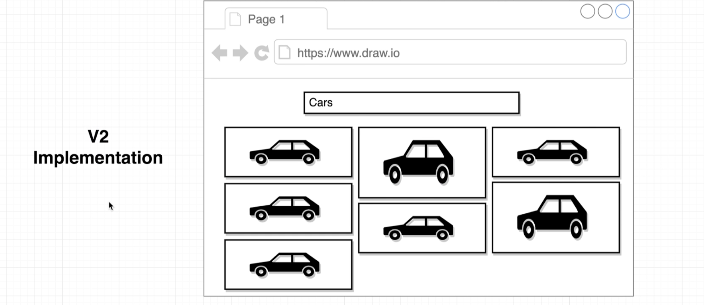
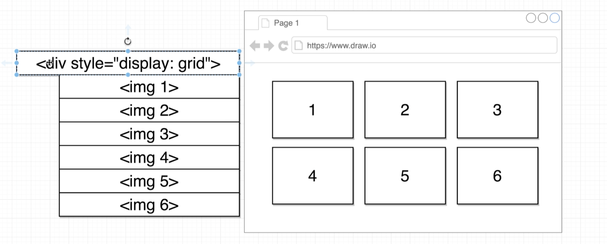
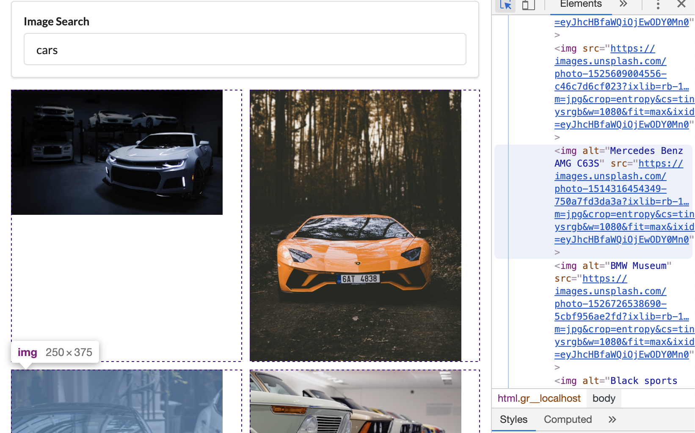
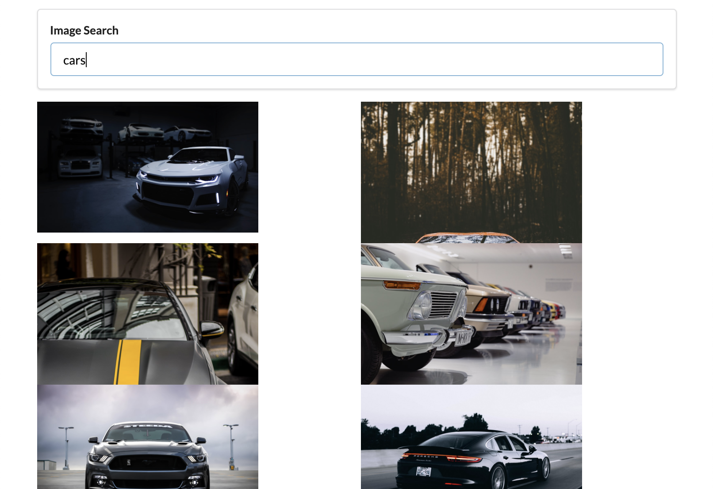

## Grid CSS

- so far, we've now got our list of images to display successfully
- But the problem is our images are really really large.
- so we're going to start working on this V-2 Implementation


---
- create ImageList.css
```css
.image-list{
    display: grid;
    grid-template-columns: repeat(auto-fill, minmax(250px, 1fr));
    grid-gap: 10px;
}

.image-list img {
    width: 250px;
}
```
- 
- update ImageList.js
```js
//Grid CSS
import React from 'react';
import './ImageList.css';

const ImageList = (props) => {
    const images = props.images.map(({ description, id, urls }) => {
        return 
    });

    return <div className='image-list'>{images}</div>;
};
export default ImageList;
```

---

## Issues with Grid CSS

- update ImageList.css
```css
.image-list{
    display: grid;
    grid-template-columns: repeat(auto-fill, minmax(250px, 1fr));
    grid-gap: 10px;
    grid-auto-rows: 150px;

}

.image-list img {
    width: 250px;
    grid-row-end: span 2;
}
```

- there is still problem
---


## Creating an Image Card Component
- App.js
```js
class App extends React.Component {
    state = { images: [] }

    onSearchSubmit = async (term) => {
        const response = await unsplash.get('search/photos', {
            params: { query: term }
        });

        this.setState({ images: response.data.results });
    }

    render() {
        return (
            <div className="ui container" style={{ marginTop: '10px' }}>
                <SearchBar onSubmit={this.onSearchSubmit} />
                <ImageList images={this.state.images} />
            </div >
        );
    }
};
```
-
- update ImageList.js
```js
//Creating an Image Card Component
import React from 'react';
import './ImageList.css';
import ImageCard from './ImageCard';

const ImageList = (props) => {
    const images = props.images.map((image) => {
        return <ImageCard key={image.id} image={image} />
    });

    return <div className='image-list'>{images}</div>;
};
export default ImageList;
```
1. when user fires onSubmit event, then using `get` method and passing `term` to params, then callback function invoking, waiting its results, assigns results to variable `images`, setState will change `state`
2. Remember: parent App will passing it's props value to child ImageList, for here props's value is an arry images[]
3. `return <ImageCard key={image.id} image={image} />`, this statement, assigns every image to variable `image`, only parent `ImageList` can pass value to child `ImageCard`

-
- create ImageCard.js
```js
import React from 'react';
class ImageCard extends React.Component {
    render() {
        const { description, urls } = this.props.image;
        return (
            <div>
                
            </div>
        );
    }
}
export default ImageCard;
```
4. parent `ImageList` passing value to child `ImageCard`, IamgeCard receive value via `this.props.image`

---


