## App Overview
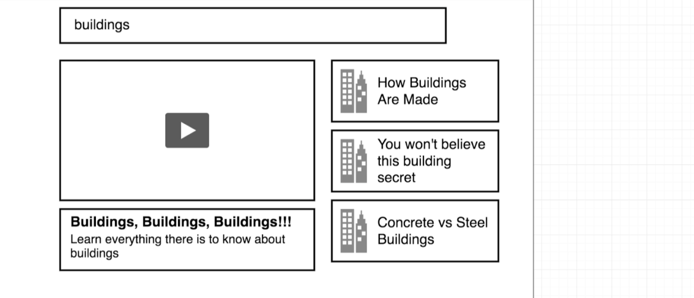
---

## Component Design
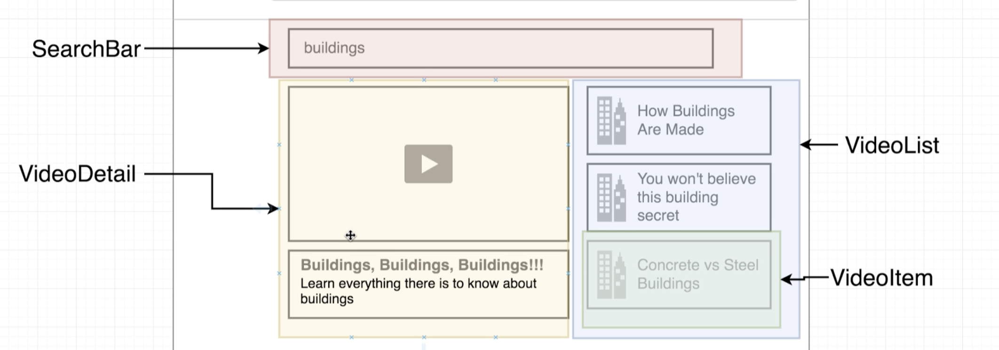
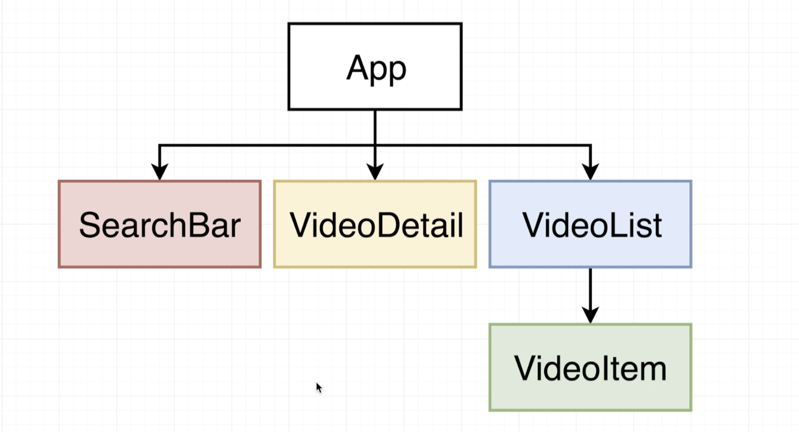
---

## Scaffolding the App
- create a new project named `videos`
- `npx create-react-app videos`
- delete all files from src folder
- 
- create index.js
```js
import React from 'react';
import ReactDOM from 'react-dom';
import App from './components/App';

ReactDOM.render(<App />, document.querySelector('#root'));
```
-
- create App.js, index import App
```js
import React from 'react';
import SearchBar from './SearchBar';
class App extends React.Component {
    render() {
        return <div><SearchBar /></div>;
    }
}
export default App;
```
-
- create SearchBar.js
```js
import React from 'react';

class SearchBar extends React.Component {
    render() {
        return <div>SearchBar</div>;
    }
}
export default SearchBar;
```
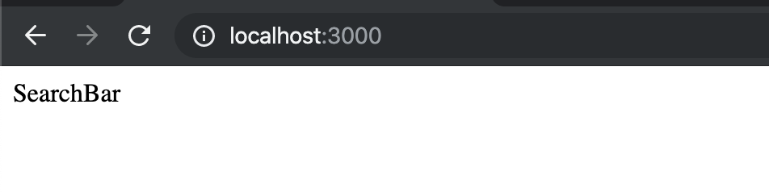
---


## Reminder on Event Handlers
- import semantic.css into index.html
- `<link rel="stylesheet" href="https://cdnjs.cloudflare.com/ajax/libs/semantic-ui/2.4.1/semantic.min.css" />`
- 
- update SearchBar.js
```js
//Reminder on Event Handlers
import React from 'react';

class SearchBar extends React.Component {
    render() {
        return (
            <div className="search-bar ui segment">
                <form className="ui form">
                    <div className='field'>
                        <label>Video Search</label>
                        <input type="text" />
                    </div>
                </form>
            </div>
        );
    }
}
export default SearchBar;
```
-
- update App
```js
//Reminder on Event Handlers
import React from 'react';
import SearchBar from './SearchBar';
class App extends React.Component {
    render() {
        return (
            <div className="ui container">
                <SearchBar />
            </div>
        );
    }
}
export default App;
```
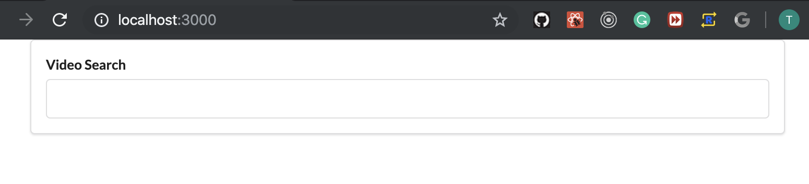
---
-
- update SearchBar
```js
//Reminder on Event Handlers
import React from 'react';

class SearchBar extends React.Component {
    state = { term: 'Hello world!' }
    render() {
        return (
            <div className="search-bar ui segment">
                <form className="ui form">
                    <div className='field'>
                        <label>Video Search</label>
                        <input type="text" value={this.state.term} />
                    </div>
                </form>
            </div>
        );
    }
}
export default SearchBar;
```
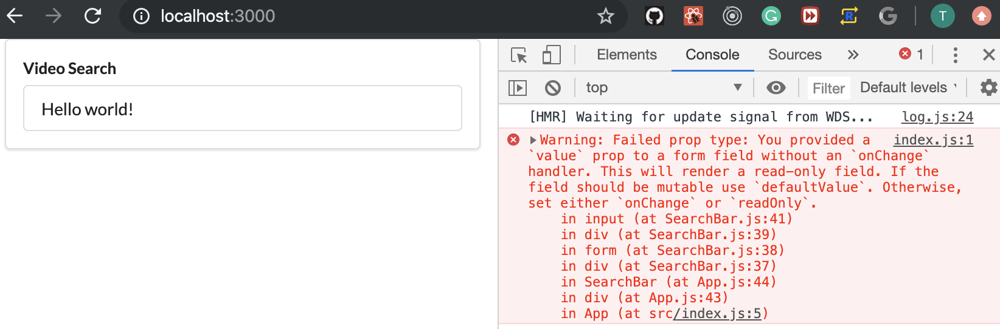
- the warning states that we should provide a `onChange`
---

## Handling Form Submittal
- update SearchBar
```js
//Reminder on Event Handlers
import React from 'react';

class SearchBar extends React.Component {
    state = { term: '' }

    onInputChange = (event) => {
        this.setState({ term: event.target.value })
    };

    onFormSubmit = (event) => {
        event.preventDefault();

        //TODO: Make sure we call
        //callback from parent component
    };

    render() {
        return (
            <div className="search-bar ui segment">
                <form onSubmit={this.onFromSubmit} className="ui form">
                    <div className='field'>
                        <label>Video Search</label>
                        <input type="text"
                            value={this.state.term}
                            onChange={this.onInputChange}
                        />
                    </div>
                </form>
            </div>
        );
    }
}
export default SearchBar;
```
---


## Accessing the Youtube API
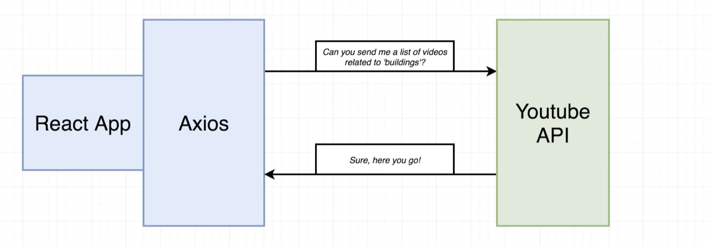
- go to google API
- `console.developers.google.com`
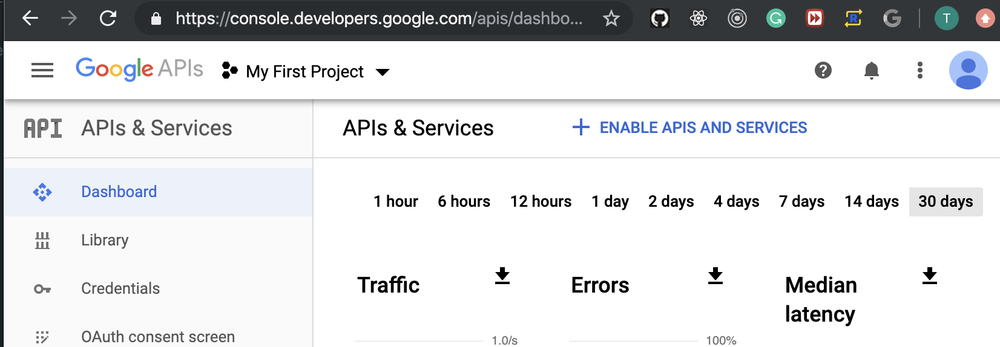
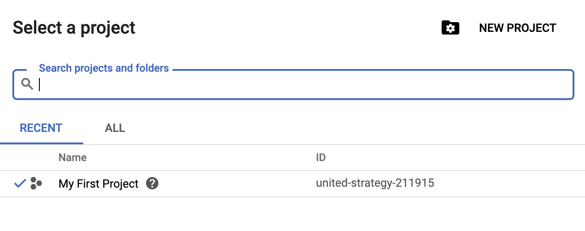
- click `NEW PROJECT`
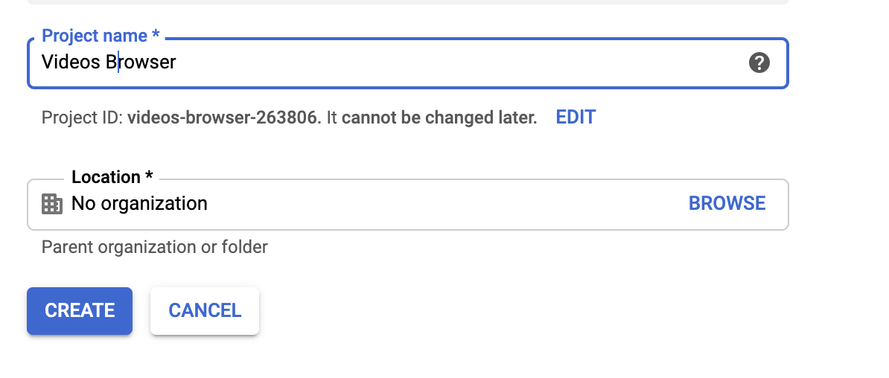
- click `create`
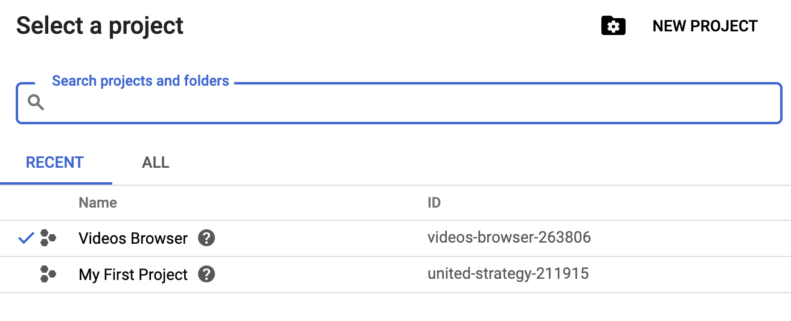
- choose and click `videos browser `
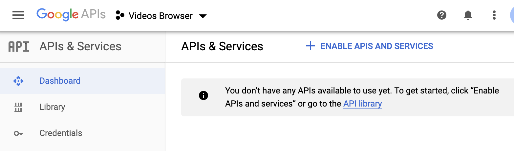
- click `ENABLE APIS AND SERVICES`

- on search bar, input `youtube`
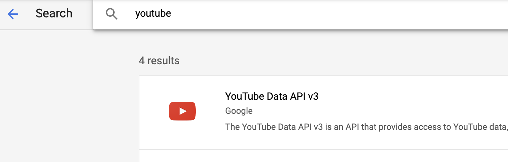
- choose `YouTube Data API v3`
- click
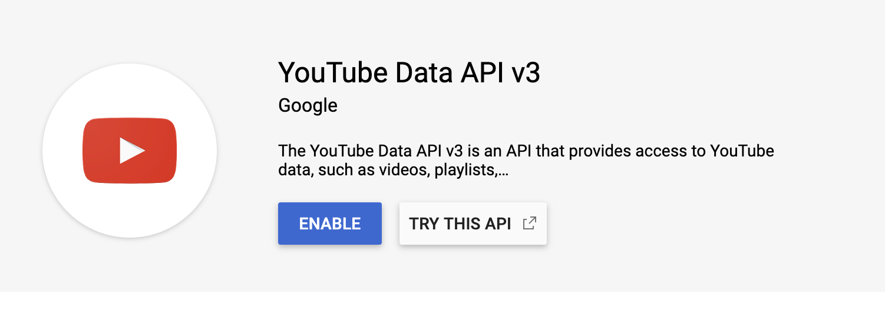
- click `ENABLE`
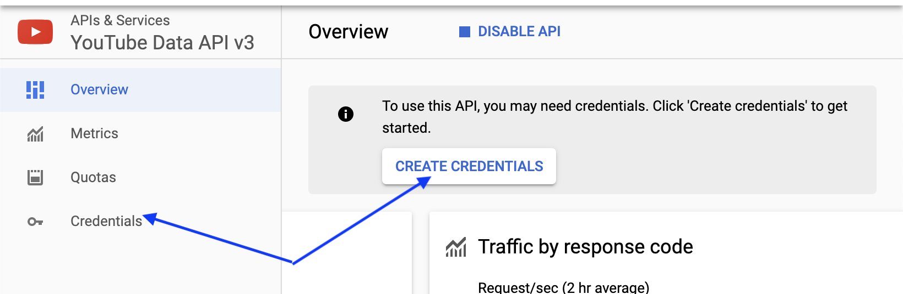
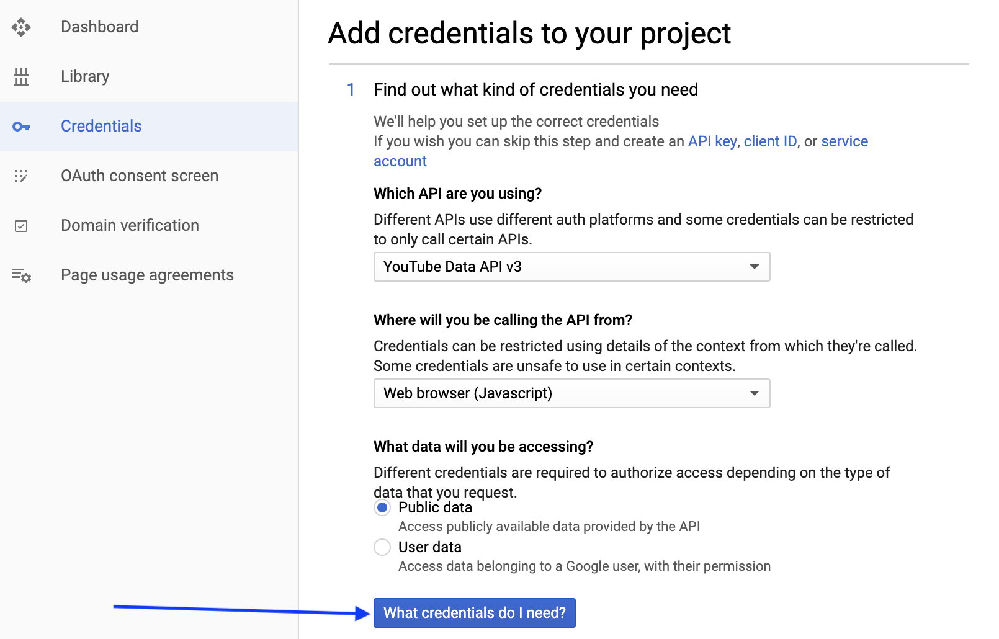
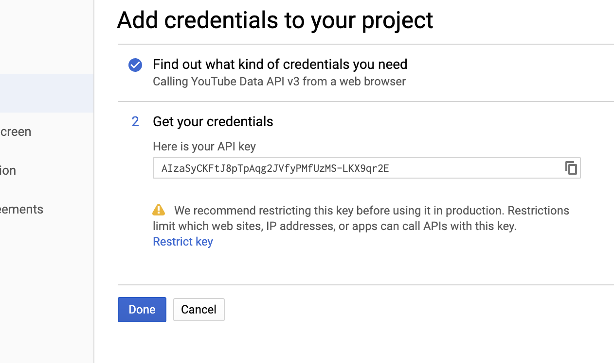
- copied this key
- go back to our app
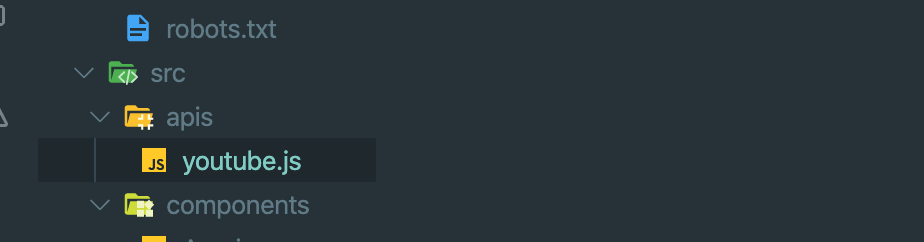
- create `apis` -> `youtube.js`
- pass current copied key into `youtube.js`
---

## Searching for Videos
- google search `youtube api search`
- 
