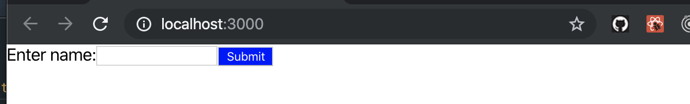
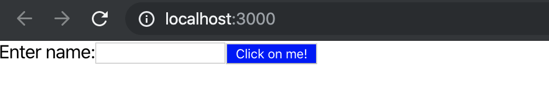
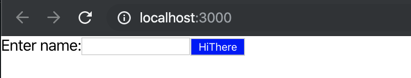
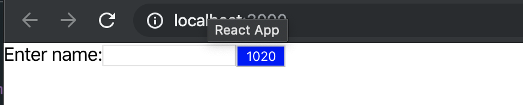
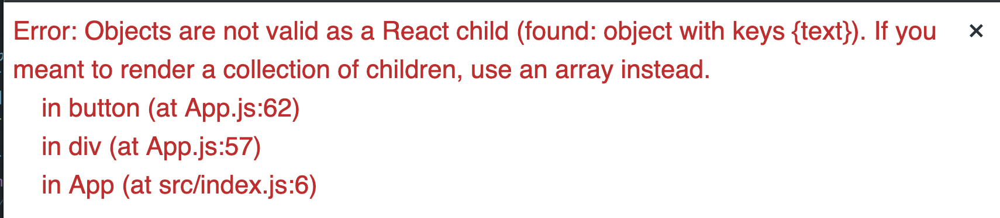
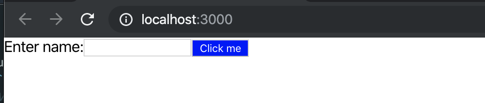

## Create a new project
- `npx create-react-app jsx`
- update index.js
```js
import React from 'react';
import ReactDOM from 'react-dom';
import './index.css';
import App from './App';

ReactDOM.render(<App />, document.getElementById('root'));
```
- update App.js
```js
import React from 'react';
import logo from './logo.svg';
import './App.css';

function App() {
  return (
    <div>
      <label class="label" for="name">
        Enter name:
      </label>
      <input id="name" type="text" />
      <button style={{ backgroundColor: 'blue', color: 'white' }}>
        Submit
      </button>
    </div>
  );
}

export default App;
```

---

- update App
```js
import React from 'react';
import logo from './logo.svg';
import './App.css';

function App() {
  const buttonText = 'Click Me!';
  return (
    <div>
      <label className="label" for="name">
        Enter name:
      </label>
      <input id="name" type="text" />
      <button style={{ backgroundColor: 'blue', color: 'white' }}>
        {buttonText}
      </button>
    </div>
  );
}
export default App;
```
- adding a buttonText
- 
- adding a getButtonText() 
- update App
```js
import React from 'react';
import logo from './logo.svg';
import './App.css';

function getButtonText() {
  return 'Click on me!';
}

function App() {
  const buttonText = 'Click Me!';
  return (
    <div>
      <label className="label" for="name">
        Enter name:
      </label>
      <input id="name" type="text" />
      <button style={{ backgroundColor: 'blue', color: 'white' }}>
        {getButtonText()}
      </button>
    </div>
  );
}

export default App;
```

---

```js
function App() {
  // const buttonText = 'Click Me!';
  const buttonText = ['Hi', 'There'];
  return (
    <div>
      <label className="label" for="name">
        Enter name:
      </label>
      <input id="name" type="text" />
      <button style={{ backgroundColor: 'blue', color: 'white' }}>
        {buttonText}
      </button>
    </div>
  );
}
```

```js
  const buttonText = [10, 20];
```

---

- if change to:
```js
  const buttonText = { text: 'Click me' };
```

- so neet to fix
- update App.js
```js
//Values JSX Can't show
import React from 'react';
import logo from './logo.svg';
import './App.css';

function App() {
  // const buttonText = 'Click Me!';
  // const buttonText = ['Hi', 'There'];
  // const buttonText = [10, 20];
  const buttonText = { text: 'Click me' };
  return (
    <div>
      <label className="label" for="name">
        Enter name:
      </label>
      <input id="name" type="text" />
      <button style={{ backgroundColor: 'blue', color: 'white' }}>
        {buttonText.text}
      </button>
    </div>
  );
}

export default App;
```

- we can create a new object, and assign css style value
- update App
```js
//Values JSX Can't show
import React from 'react';
import logo from './logo.svg';
import './App.css';

function App() {
  const buttonText = { text: 'Click me' };
  const style = { backgroundColor: 'blue', color: 'white' };
  return (
    <div>
      <label className="label" for="name">
        Enter name:
      </label>
      <input id="name" type="text" />
      <button style={style}>
        {buttonText.text}
      </button>
    </div>
  );
}

export default App;
```
- still same result
-
- update App
```js
function App() {
  const buttonText = { text: 'Click me' };
  const style = { backgroundColor: 'blue', color: 'white' };
  const labelText = 'Enter name: ';

  return (
    <div>
      <label className="label" for="name">
        {labelText} 
      </label>
      <input id="name" type="text" />
      <button style={style}>
        {buttonText.text}
      </button>
    </div>
  );
}
``` 
- same result
---

## change some tag names to React's syntax
- update App.js
```js
  return (
    <div>
      <label className="label" htmlFor="name">
        {labelText}
      </label>
      <input id="name" type="text" />
      <button style={style}>
        {buttonText.text}
      </button>
    </div>
  );
```