## create a new project named components
- delete all files from src foler
- we want to build a project like this:

- create index.js in src 
- index.js
```js
import React from 'react';
import ReactDOM from 'react-dom';

const App = () => {
    return <div>Hi There!</div>
};

ReactDOM.render(<App />, document.getElementById('root'));
```
- import `Semantic UI`, is an open source styling or CSS framework
- `https://semantic-ui.com/`
- serach `semantic cdn`
- `https://cdnjs.cloudflare.com/ajax/libs/semantic-ui/2.4.1/semantic.min.css`
- put it into `public/index.html`
- index.html
```html
<link rel="stylesheet" href="https://cdnjs.cloudflare.com/ajax/libs/semantic-ui/2.4.1/semantic.min.css" />
```

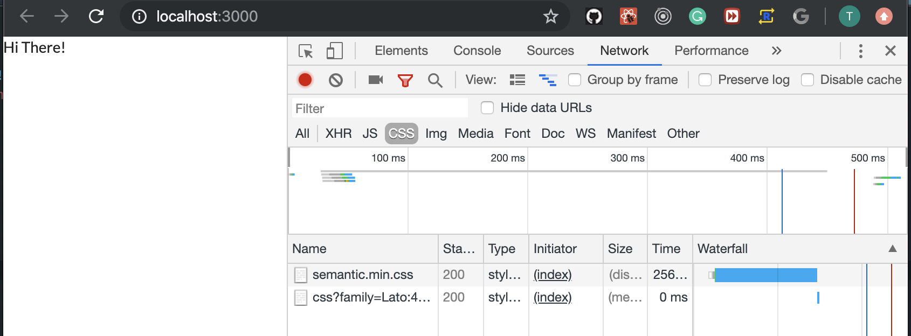
---


## Naive Component Approach
- update index.js
```js
import React from 'react';
import ReactDOM from 'react-dom';

const App = () => {
    return (
        <div className="ui container comments">
            <div className="comment">
                <a href="/" className="avatar">
                    
                </a>
                <div className="content">
                    <a href="/" className="author">
                        Sam
                    </a>
                    <div className="metadata">
                        <span className="date">Today at 6:00 PM</span>
                    </div>
                    <div className="text">Nice blog post!</div>
                </div>
            </div>
        </div>
    );
};

ReactDOM.render(<App />, document.getElementById('root'));
```
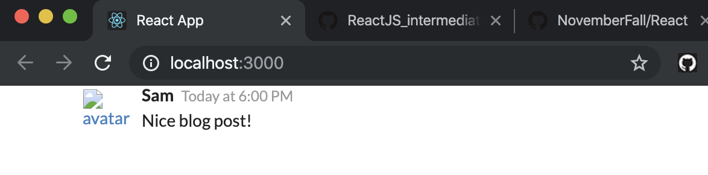
---

## Specifying Images in JSX
- import `faker js`
- search on github
- This is an open soure lirbary they can help you automatically generate a ton of data to use inside of our project
-
- install faker js
- `npm install --save faker`
- so we can call `faker.image.avatar()`, more function you can review on github faker js
- 
- npm start 
- 
- update index.js
```js
//Specifying Images in JSX
import React from 'react';
import ReactDOM from 'react-dom';
import faker from 'faker';

const App = () => {
    return (
        <div className="ui container comments">
            <div className="comment">
                <a href="/" className="avatar">
                    
                </a>
                <div className="content">
                    <a href="/" className="author">
                        Sam
                    </a>
                    <div className="metadata">
                        <span className="date">Today at 6:00 PM</span>
                    </div>
                    <div className="text">Nice blog post!</div>
                </div>
            </div>
        </div>
    );
};
ReactDOM.render(<App />, document.getElementById('root'));
```

---

## Duplicating a Single Component
- duplicating two component twice
- index.js
```js
import React from 'react';
import ReactDOM from 'react-dom';
import faker from 'faker';

const App = () => {
    return (
        <div className="ui container comments">
            <div className="comment">
                <a href="/" className="avatar">
                    
                </a>
                <div className="content">
                    <a href="/" className="author">
                        Sam
                    </a>
                    <div className="metadata">
                        <span className="date">Today at 6:00 PM</span>
                    </div>
                    <div className="text">Nice blog post!</div>
                </div>
            </div>
            <div className="comment">
                <a href="/" className="avatar">
                    
                </a>
                <div className="content">
                    <a href="/" className="author">
                        Sam
                    </a>
                    <div className="metadata">
                        <span className="date">Today at 6:00 PM</span>
                    </div>
                    <div className="text">Nice blog post!</div>
                </div>
            </div>
            <div className="comment">
                <a href="/" className="avatar">
                    
                </a>
                <div className="content">
                    <a href="/" className="author">
                        Sam
                    </a>
                    <div className="metadata">
                        <span className="date">Today at 6:00 PM</span>
                    </div>
                    <div className="text">Nice blog post!</div>
                </div>
            </div>
        </div>
    );
};

ReactDOM.render(<App />, document.getElementById('root'));
```

---


## Extracting JSX to New Components
- create CommentDetail.js in src folder
```js
import React from 'react';

const CommentDetail = () => {
    return (
        <div className="comment">
            <a href="/" className="avatar">
                
            </a>
            <div className="content">
                <a href="/" className="author">
                    Sam
                </a>
                <div className="metadata">
                    <span className="date">Today at 6:00 PM</span>
                </div>
                <div className="text">Nice blog post!</div>
            </div>
        </div>
    );
};
```
- but there is some hard codes: `Sam, Today at 6:00 PM, Nice blog post!`
---

## Component Nesting

- in order to get this comment detail component to show up inside of index.js


- update CommentDetail.js
```js
//Extracting JSX to New Components
import React from 'react';
import faker from 'faker';

const CommentDetail = () => {
    return (
        <div className="comment">
            <a href="/" className="avatar">
                
            </a>
            <div className="content">
                <a href="/" className="author">
                    Sam
                </a>
                <div className="metadata">
                    <span className="date">Today at 6:00 PM</span>
                </div>
                <div className="text">Nice blog post!</div>
            </div>
        </div>
    );
};
export default CommentDetail;
```
- update index.js
```js
//Extracting JSX to New Components
import React from 'react';
import ReactDOM from 'react-dom';
import faker from 'faker';
import CommentDeatil from './CommentDetail';

const App = () => {
    return (
        <div className="ui container comments">
            <CommentDeatil />
            <CommentDeatil />
            <CommentDeatil />
            <CommentDeatil />
            <CommentDeatil />
        </div>
    );
};

ReactDOM.render(<App />, document.getElementById('root'));
```

---

## React's Props System
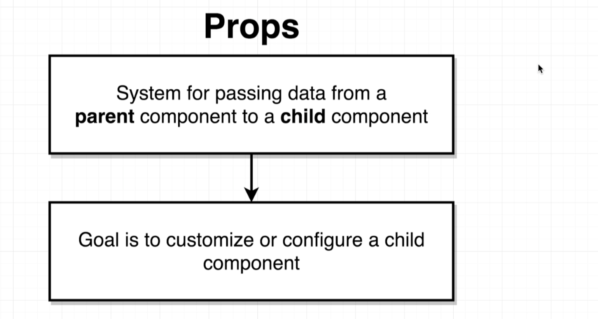
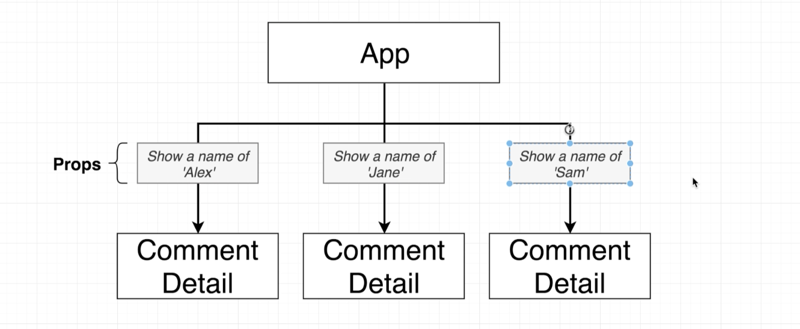
---


### Passing and Receiving Propos
- Note: **A child cannot pass data backup to the parent through the system directly**
- update index.js
```js
//Passing and Receiving Propos
import React from 'react';
import ReactDOM from 'react-dom';
import faker from 'faker';
import CommentDeatil from './CommentDetail';

const App = () => {
    return (
        <div className="ui container comments">
            <CommentDeatil author="Sam" />
            <CommentDeatil author="Alex" />
            <CommentDeatil author="Jane" />
        </div>
    );
};
ReactDOM.render(<App />, document.getElementById('root'));
```
-
- update CommentDetail.js
```js
//Passing and Receiving Propos
import React from 'react';
import faker from 'faker';

const CommentDetail = (props) => {
    console.log(props);
    return (
        <div className="comment">
            <a href="/" className="avatar">
                
            </a>
            <div className="content">
                <a href="/" className="author">
                    {props.author}
                </a>
                <div className="metadata">
                    <span className="date">Today at 6:00 PM</span>
                </div>
                <div className="text">Nice blog post!</div>
            </div>
        </div>
    );
};
export default CommentDetail;
```
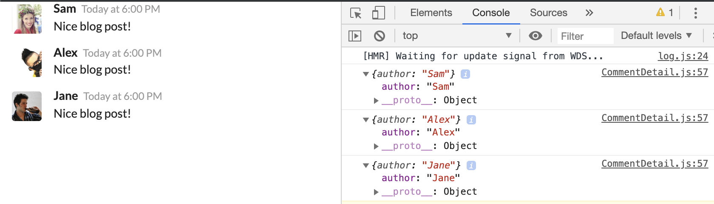
---

## Passing Multiple Props
- update index.js
```js
//Passing Multiple Props
import React from 'react';
import ReactDOM from 'react-dom';
import faker from 'faker';
import CommentDeatil from './CommentDetail';

const App = () => {
    return (
        <div className="ui container comments">
            <CommentDeatil
                author="Sam"
                timeAgo="Today at 4:45PM"
                content="Nice blog post"
                avatar={faker.image.avatar()}
            />
            <CommentDeatil
                author="Alex"
                timeAgo="Today at 2:00AM"
                content="I like the subject"
                avatar={faker.image.avatar()}
            />
            <CommentDeatil
                author="Jane"
                timeAgo="Yesterday at 5:00PM"
                content="I like the writing"
                avatar={faker.image.avatar()}
            />
        </div>
    );
};

ReactDOM.render(<App />, document.getElementById('root'));
```
- update CommentDetail.js
```js
//Passing Multiple Props
import React from 'react';
import faker from 'faker';

const CommentDetail = (props) => {
    console.log(props);
    return (
        <div className="comment">
            <a href="/" className="avatar">
                
            </a>
            <div className="content">
                <a href="/" className="author">
                    {props.author}
                </a>
                <div className="metadata">
                    <span className="date">{props.timeAgo}</span>
                </div>
                <div className="text">{props.content}</div>
            </div>
        </div>
    );
};
export default CommentDetail;
```
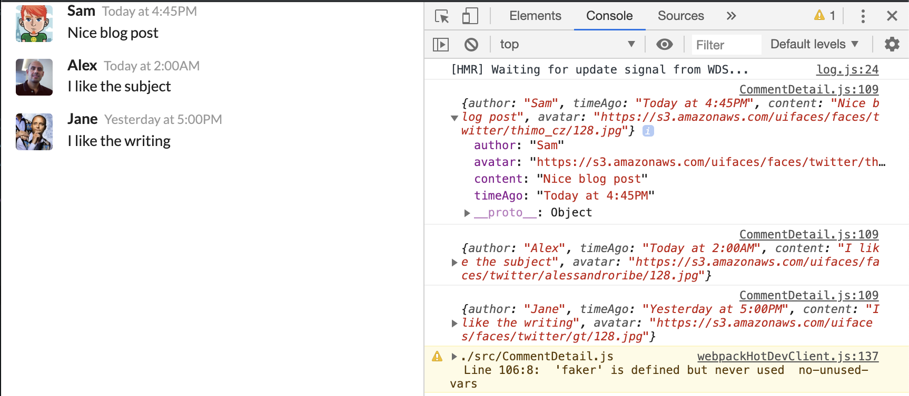
---

## Component Reuse
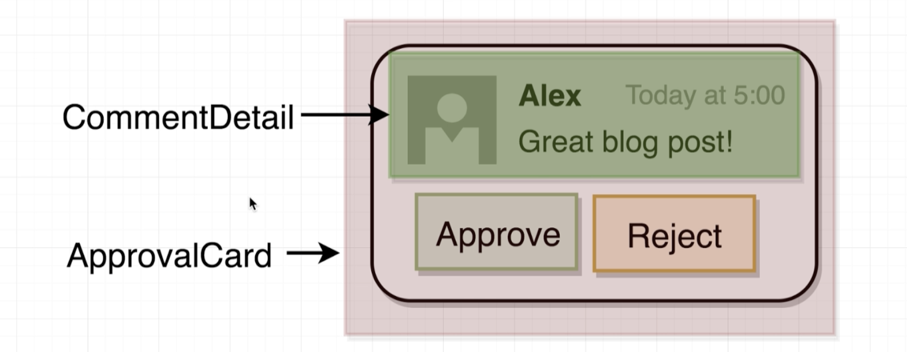
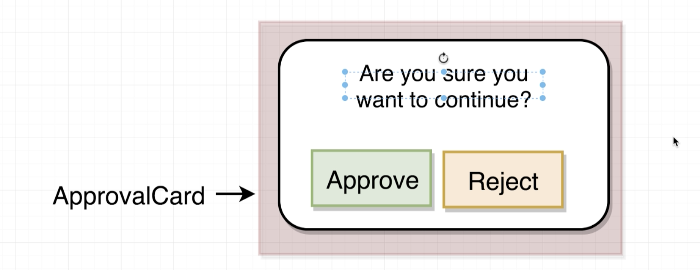
---

## Implementing an Approval Card
- create `ApprovalCard.js` in src folder
- now we can check semantic-ui for `Cards`' source codes
- ApprovalCard.js
```js
import React from 'react';

const ApprovalCard = () => {
    return (
        <div className="ui card">
            <div className="content">Are you sure?</div>
            <div className="extra content">
                <div className="ui two buttons">
                    <div className="ui basic green button">Approve</div>
                    <div className="ui basic red button">Reject</div>
                </div>
            </div>
        </div>
    );
};
export default ApprovalCard;
```
-
- update index.js
```js
//Implementing an Approval Card
import React from 'react';
import ReactDOM from 'react-dom';
import faker from 'faker';
import CommentDeatil from './CommentDetail';
import ApprovalCard from './ApprovalCard';

const App = () => {
    return (
        <div className="ui container comments">
            <ApprovalCard />
            <CommentDeatil
                author="Sam"
                timeAgo="Today at 4:45PM"
                content="Nice blog post"
                avatar={faker.image.avatar()}
            />
            <CommentDeatil
                author="Alex"
                timeAgo="Today at 2:00AM"
                content="I like the subject"
                avatar={faker.image.avatar()}
            />
            <CommentDeatil
                author="Jane"
                timeAgo="Yesterday at 5:00PM"
                content="I like the writing"
                avatar={faker.image.avatar()}
            />
        </div>
    );
};

ReactDOM.render(<App />, document.getElementById('root'));
```
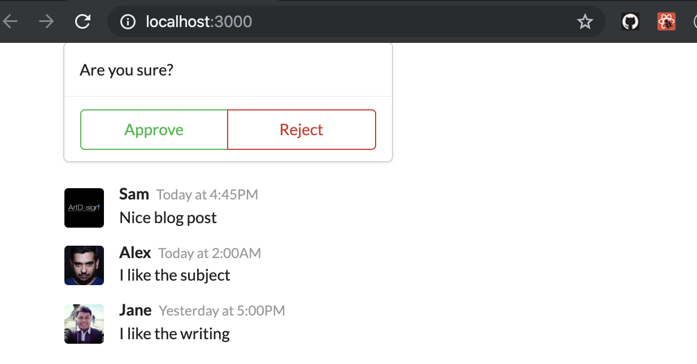
---


## Showing Custom Children
- update index.js
```js
//Showing Custom Children
import React from 'react';
import ReactDOM from 'react-dom';
import faker from 'faker';
import CommentDeatil from './CommentDetail';
import ApprovalCard from './ApprovalCard';

const App = () => {
    return (
        <div className="ui container comments">
            <ApprovalCard>
                <CommentDeatil
                    author="Sam"
                    timeAgo="Today at 4:45PM"
                    content="Nice blog post"
                    avatar={faker.image.avatar()}
                />
            </ApprovalCard>

            <CommentDeatil
                author="Alex"
                timeAgo="Today at 2:00AM"
                content="I like the subject"
                avatar={faker.image.avatar()}
            />
            <CommentDeatil
                author="Jane"
                timeAgo="Yesterday at 5:00PM"
                content="I like the writing"
                avatar={faker.image.avatar()}
            />
        </div>
    );
};

ReactDOM.render(<App />, document.getElementById('root'));
```
- update ApprovalCard.js
```js
//Showing Custom Children
import React from 'react';

const ApprovalCard = (props) => {
    // console.log(props);
    console.log(props.children);
    return (
        <div className="ui card">
            <div className="content">{props.children}</div>
            <div className="extra content">
                <div className="ui two buttons">
                    <div className="ui basic green button">Approve</div>
                    <div className="ui basic red button">Reject</div>
                </div>
            </div>
        </div>
    );
};
export default ApprovalCard;
```
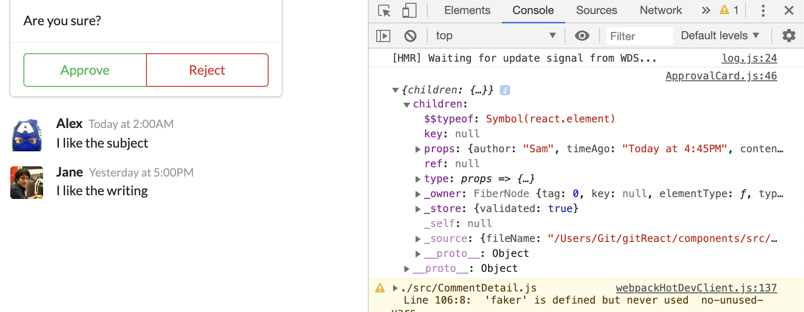
---
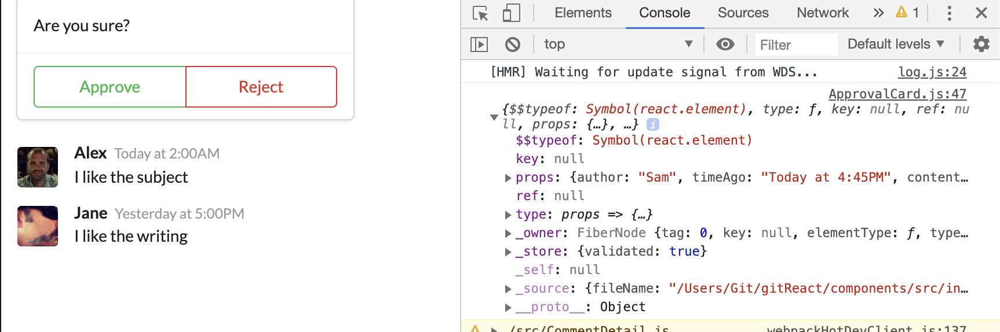
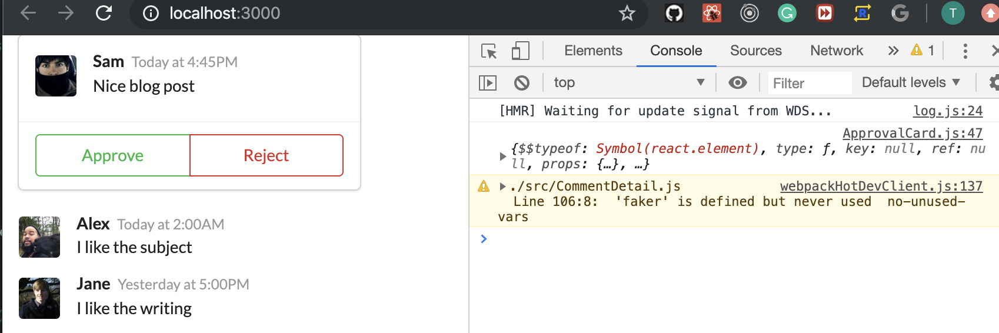
---

- update index.js
```js
//Showing Custom Children
import React from 'react';
import ReactDOM from 'react-dom';
import faker from 'faker';
import CommentDeatil from './CommentDetail';
import ApprovalCard from './ApprovalCard';

const App = () => {
    return (
        <div className="ui container comments">
            <ApprovalCard>
                <CommentDeatil
                    author="Sam"
                    timeAgo="Today at 4:45PM"
                    content="Nice blog post"
                    avatar={faker.image.avatar()}
                />
            </ApprovalCard>

            <ApprovalCard>
                <CommentDeatil
                    author="Alex"
                    timeAgo="Today at 2:00AM"
                    content="I like the subject"
                    avatar={faker.image.avatar()}
                />
            </ApprovalCard>

            <ApprovalCard>
                <CommentDeatil
                    author="Jane"
                    timeAgo="Yesterday at 5:00PM"
                    content="I like the writing"
                    avatar={faker.image.avatar()}
                />
            </ApprovalCard>

        </div>
    );
};

ReactDOM.render(<App />, document.getElementById('root'));
```
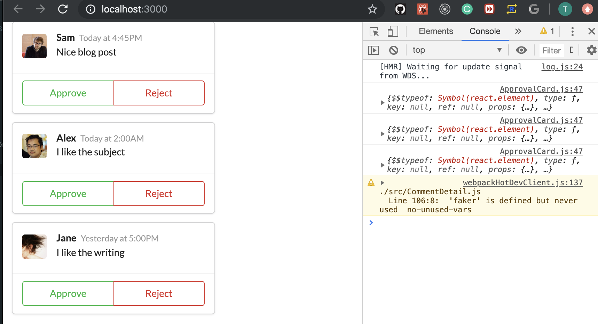
---


