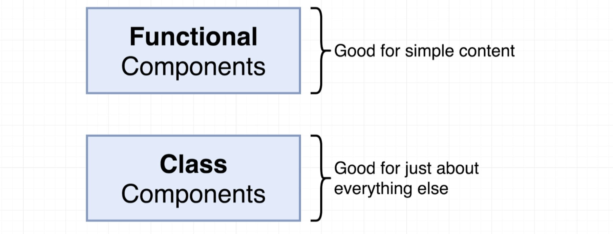
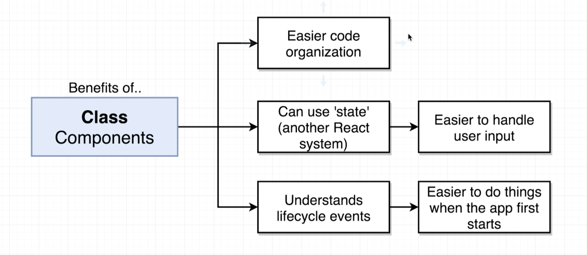
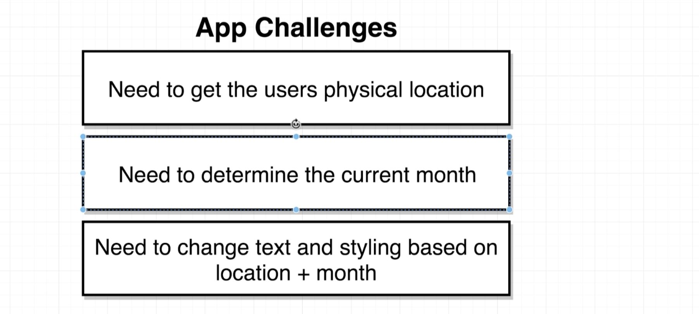
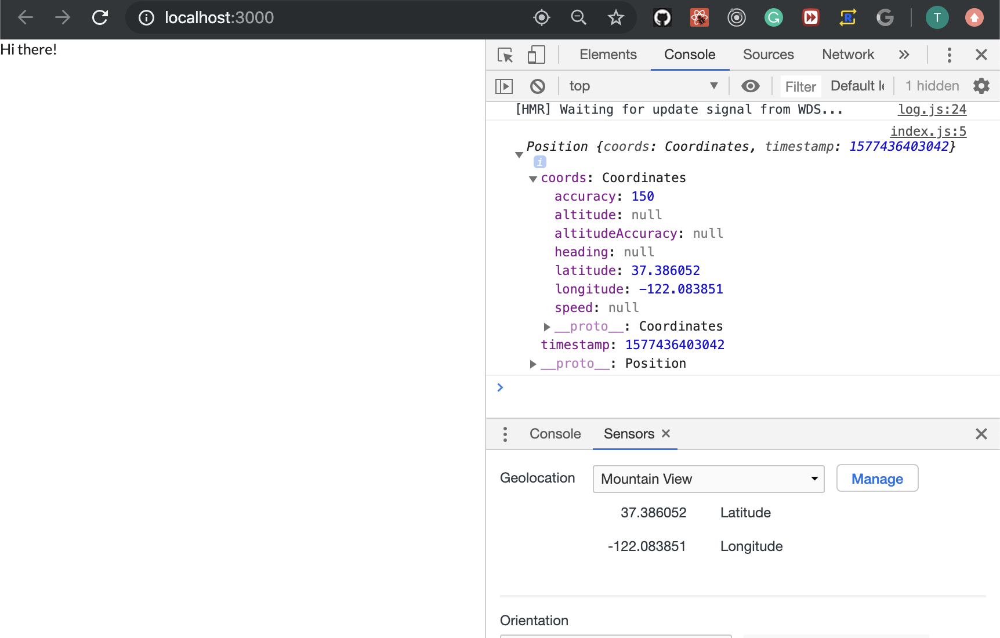

## Class-Based Components

- why using Class Components?

---

## Application Overview

---

## Scaffolding the App
- import semantic ui css library into index.html
- `<link rel="stylesheet" href="https://cdnjs.cloudflare.com/ajax/libs/semantic-ui/2.4.1/semantic.min.css" />`
- still delete all files from src folder
- create index.js in src folder
- create SeasonDisplay.js in src
---

## Getting a User Physical Location
- import Geolocation API
- google MDN Geolocation API
- 
- update index.js
```js
import React from 'react';
import ReactDOM from 'react-dom';

const App = () => {
    window.navigator.geolocation.getCurrentPosition(
        (position) => console.log(position),
        (err) => console.log(err)
    );
    return <div>Hi there!</div>;
};

ReactDOM.render(<App />, document.getElementById('root'));
```
- update SeansonDisplay.js
```js
import React from 'react';

const SeasonDisplay = () => {
    return <div>Seanson Display</div>;
};
export default SeasonDisplay;
```

- if we can get the geolocation, can set like the above 
- but how to open `Sensors` ?
    1. `Press Command+Shift+P (Mac)`
    2. `Type sensors, select Show Sensors`
---

## change to class
- update index.js
```js
import React from 'react';
import ReactDOM from 'react-dom';

class App extends React.Component {
    render() {
        window.navigator.geolocation.getCurrentPosition(
            (position) => console.log(position),
            (err) => console.log(err)
        );

        return <div>Latitude: </div>;
    }
}

ReactDOM.render(<App />, document.getElementById('root'));
```
- SeasonDisplay.js
```js
import React from 'react';

const SeasonDisplay = () => {
    return <div>Seanson Display</div>;
};
export default SeasonDisplay;
```
---

