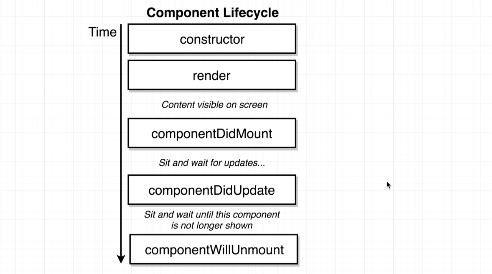
- added lifecycle function
- update index.js
```js
//Conditionally Rendering Content
import React from 'react';
import ReactDOM from 'react-dom';

class App extends React.Component {
    constructor(props) {
        super(props);

        //THIS IS THE ONLY TIME we do direct assignment to this.state
        this.state = { lat: null, errorMessage: '' };

        window.navigator.geolocation.getCurrentPosition(
            (position) => {
                //we called setState
                this.setState({ lat: position.coords.latitude });

                //we never do this:
                // this.state.lat = position.coords.latitude;
            },
            (err) => {
                this.setState({ errorMessage: err.message });
            }
        );
    };

    //life cycle function
    componentDidMount() {
        console.log('My component was rendered to the screen');
    }

    componentDidUpdate() {
        console.log('My component was just updated - it rerendered!');
    }


    render() {
        if (this.state.errorMessage && !this.state.lat) {
            return <div>Error: {this.state.errorMessage}</div>
        }

        if (!this.state.errorMessage && this.state.lat) {
            return <div>Latitude: {this.state.lat}</div>
        }

        return <div>Loading!</div>
    }
}

ReactDOM.render(<App />, document.getElementById('root'));
```
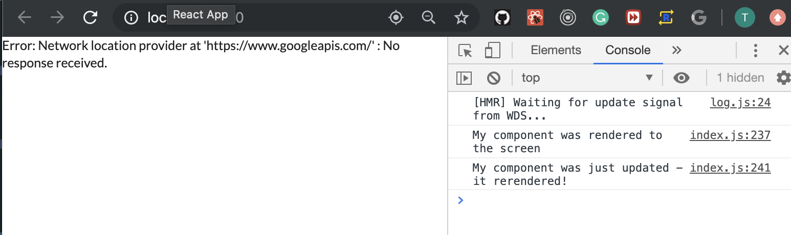
---

## Why Lifecycle Methods?
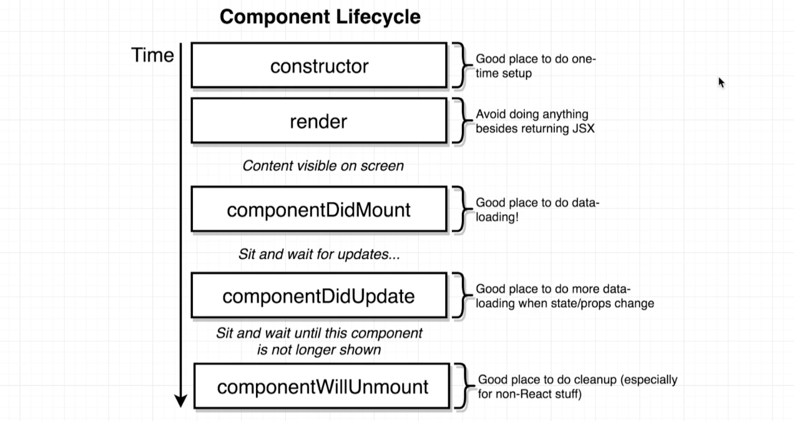
---


## Refactoring Data Loading to Lifecycle Methods
- update index.js
```js
//Refactoring Data Loading to Lifecycle Methods
import React from 'react';
import ReactDOM from 'react-dom';

class App extends React.Component {
    constructor(props) {
        super(props);

        //THIS IS THE ONLY TIME we do direct assignment to this.state
        this.state = { lat: null, errorMessage: '' };


    };

    //life cycle function
    componentDidMount() {
        window.navigator.geolocation.getCurrentPosition(
            (position) => { this.setState({ lat: position.coords.latitude }); },
            (err) => { this.setState({ errorMessage: err.message }); }
        );
    }

    componentDidUpdate() {
        console.log('My component was just updated - it rerendered!');
    }


    render() {
        if (this.state.errorMessage && !this.state.lat) {
            return <div>Error: {this.state.errorMessage}</div>
        }

        if (!this.state.errorMessage && this.state.lat) {
            return <div>Latitude: {this.state.lat}</div>
        }

        return <div>Loading!</div>
    }
}

ReactDOM.render(<App />, document.getElementById('root'));
```
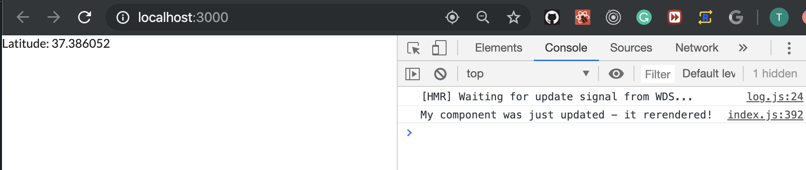
---

## Alternate State Intialization
- index.js
```js
class App extends React.Component {
    state = { lat: null, errorMessage: '' };//dont need to `this.state =`

    ... ... ...
    ... ...
    ... 
```
- same result
---

## Passing State as Props
- unpdate index.js
```js
//Passing State as Props
import React from 'react';
import ReactDOM from 'react-dom';
import SeasonDisplay from './SeasonDisplay';

class App extends React.Component {
    state = { lat: null, errorMessage: '' };//dont need to `this.state =`

    //life cycle function
    componentDidMount() {
        window.navigator.geolocation.getCurrentPosition(
            (position) => { this.setState({ lat: position.coords.latitude }); },
            (err) => { this.setState({ errorMessage: err.message }); }
        );
    }

    componentDidUpdate() {
        console.log('My component was just updated - it rerendered!');
    }


    render() {
        if (this.state.errorMessage && !this.state.lat) {
            return <div>Error: {this.state.errorMessage}</div>
        }

        if (!this.state.errorMessage && this.state.lat) {
            return <SeasonDisplay lat={this.state.lat} />
        }

        return <div>Loading!</div>
    }
}

ReactDOM.render(<App />, document.getElementById('root'));
```
- update SeasonDisplay.js
```js
import React from 'react';

const SeasonDisplay = (props) => {
    console.log(props.lat);
    return <div>Seanson Display</div>;
};
export default SeasonDisplay;
```
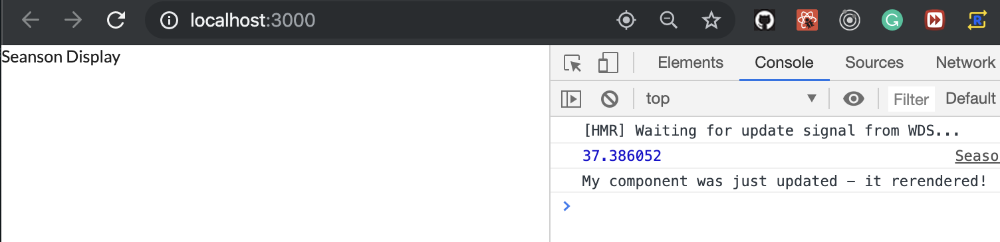
---

## Determining Season
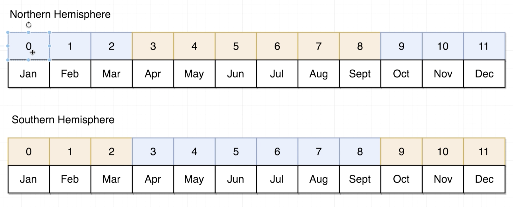
- in console, typing `new Date().getMonth()`
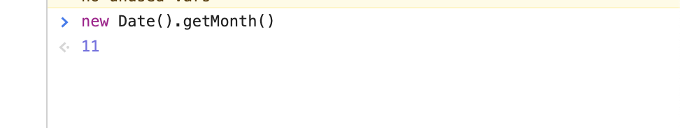
- index.js
```js
//Determining Season
import React from 'react';
import ReactDOM from 'react-dom';
import SeasonDisplay from './SeasonDisplay';

class App extends React.Component {
    state = { lat: null, errorMessage: '' };//dont need to `this.state =`

    //life cycle function
    componentDidMount() {
        window.navigator.geolocation.getCurrentPosition(
            (position) => { this.setState({ lat: position.coords.latitude }); },
            (err) => { this.setState({ errorMessage: err.message }); }
        );
    }

    render() {
        if (this.state.errorMessage && !this.state.lat) {
            return <div>Error: {this.state.errorMessage}</div>
        }

        if (!this.state.errorMessage && this.state.lat) {
            return <SeasonDisplay lat={this.state.lat} />
        }

        return <div>Loading!</div>
    }
}

ReactDOM.render(<App />, document.getElementById('root'));
```
- update SeasonDisplay.js
```js
import React from 'react';

const getSeason = (lat, month) => {
    if (month > 2 && month < 9) {
        return lat > 0 ? 'summer' : 'winter';
    } else {
        return lat > 0 ? 'winter' : 'summer';
    }
};

const SeasonDisplay = (props) => {
    const season = getSeason(props.lat, new Date().getMonth());
    console.log(season);

    return <div>Seanson Display</div>;
};
export default SeasonDisplay;
```

---


## Ternary Expressions in JSX
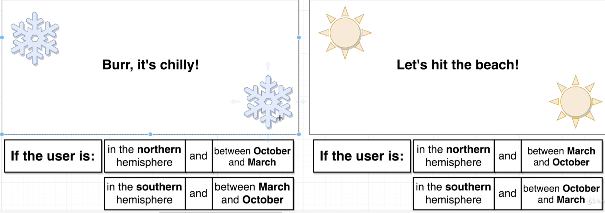
- update SeasonDisplay
```js
//Ternary Expressions in JSX
import React from 'react';

const getSeason = (lat, month) => {
    if (month > 2 && month < 9) {
        return lat > 0 ? 'summer' : 'winter';
    } else {
        return lat > 0 ? 'winter' : 'summer';
    }
};

const SeasonDisplay = (props) => {
    const season = getSeason(props.lat, new Date().getMonth());
    console.log(season);

    return <div>{season === 'winter' ? 'Burr, it is chilly' : 'Lets hit the beach'}</div>;
};
export default SeasonDisplay;
```
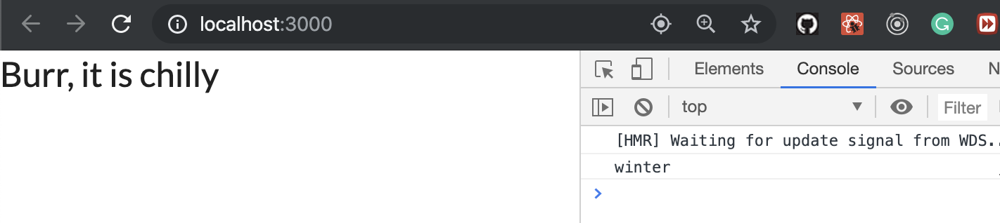
---


## Showing Icons
- Semantic UI
- update SeasonDisplay
```js
import React from 'react';

const getSeason = (lat, month) => {
    if (month > 2 && month < 9) {
        return lat > 0 ? 'summer' : 'winter';
    } else {
        return lat > 0 ? 'winter' : 'summer';
    }
};

const SeasonDisplay = (props) => {
    const season = getSeason(props.lat, new Date().getMonth());
    const text = (season === 'winter' ? 'Burr, it is chilly' : 'Lets hit the beach');
    const icon = (season === 'winter' ? 'snowflake' : 'sun');

    return (
        <div>
            <i className={`${icon} icon`} />
            <h1>{text}</h1>
            <i className={`${icon} icon`} />
        </div>
    );
};
export default SeasonDisplay;
```
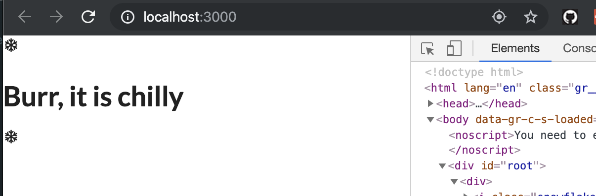
---

## Extracting Options to Config Objects
- update SeasonDisplay.js
```js
//Extracting Options to Config Objects
import React from 'react';

const seasonConfig = {
    summer: {
        text: 'Lets hit the beach!',
        iconName: 'sun'
    },
    winter: {
        text: 'Burr it is cold!',
        iconName: 'snowflake'
    }
};

const getSeason = (lat, month) => {
    if (month > 2 && month < 9) {
        return lat > 0 ? 'summer' : 'winter';
    } else {
        return lat > 0 ? 'winter' : 'summer';
    }
};

const SeasonDisplay = (props) => {
    const season = getSeason(props.lat, new Date().getMonth());
    const { text, iconName } = seasonConfig[season];

    return (
        <div>
            <i className={`${iconName} icon`} />
            <h1>{text}</h1>
            <i className={`${iconName} icon`} />
        </div>
    );
};
export default SeasonDisplay;
```
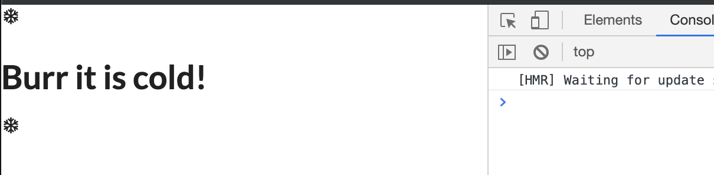
---


## Adding Some Styling
- in SeasonDisplay
```js
    return (
        <div>
            <i className={`massive ${iconName} icon`} />
            <h1>{text}</h1>
            <i className={`massive ${iconName} icon`} />
        </div>
    );
```
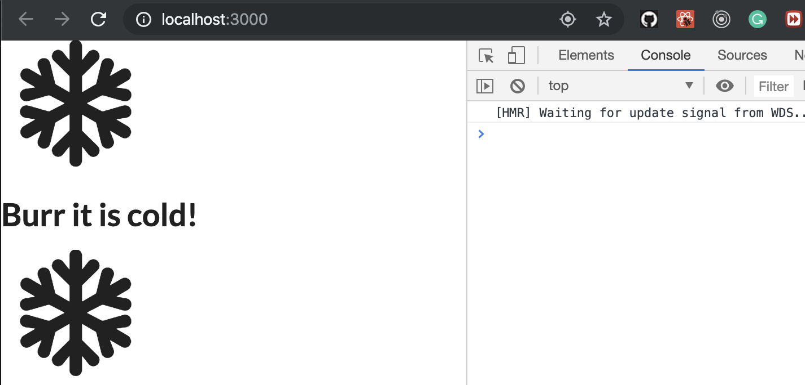
- create a .css file
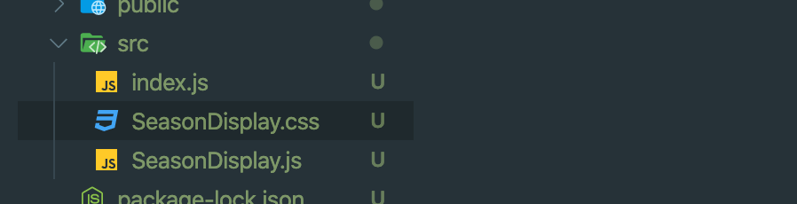
-
- SeasonDisplay.css
```css
.icon-left{
    position: absolute;
    top: 10px;
    left: 10px;
}

.icon-right{
    position: absolute;
    bottom:10px;
    right: 10px;
}
```
-
- update SeasonDisplay.js
```js
const SeasonDisplay = (props) => {
    const season = getSeason(props.lat, new Date().getMonth());
    const { text, iconName } = seasonConfig[season];

    return (
        <div>
            <i className={`icon-left massive ${iconName} icon`} />
            <h1>{text}</h1>
            <i className={`icon-right massive ${iconName} icon`} />
        </div>
    );
};
```
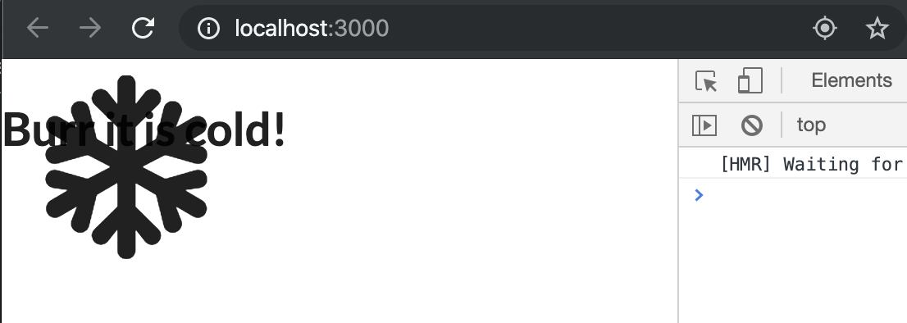
---

- update SeansonDisplay.css
```css
.icon-left{
    position: absolute;
    top: 10px;
    left: 10px;
}

.icon-right{
    position: absolute;
    bottom:10px;
    right: 10px;
}

.season-display.winter i{
    color: blue;
}

.season-display.summer i{
    color: red;
}

.season-display{
    display: flex;
    justify-content: center;
    align-items: center;
    height: 100vh;
}

.winter{
    background-color: aliceblue;
}

.summer{
    background-color: orange;
}
```
-
- update SeansonDisplay.js
```js
//Adding Some Styling
import React from 'react';
import './SeasonDisplay.css';

const seasonConfig = {
    summer: {
        text: 'Lets hit the beach!',
        iconName: 'sun'
    },
    winter: {
        text: 'Burr it is cold!',
        iconName: 'snowflake'
    }
};

const getSeason = (lat, month) => {
    if (month > 2 && month < 9) {
        return lat > 0 ? 'summer' : 'winter';
    } else {
        return lat > 0 ? 'winter' : 'summer';
    }
};

const SeasonDisplay = (props) => {
    const season = getSeason(props.lat, new Date().getMonth());
    const { text, iconName } = seasonConfig[season];

    return (
        <div className={`season-display ${season}`}>
            <i className={`icon-left massive ${iconName} icon`} />
            <h1>{text}</h1>
            <i className={`icon-right massive ${iconName} icon`} />
        </div>
    );
};
export default SeasonDisplay;
```
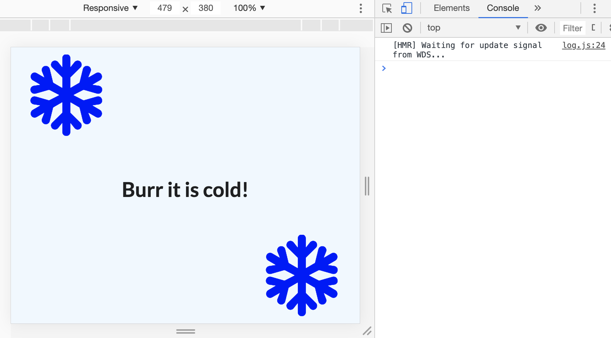
- let's change to Southern Hemisphere
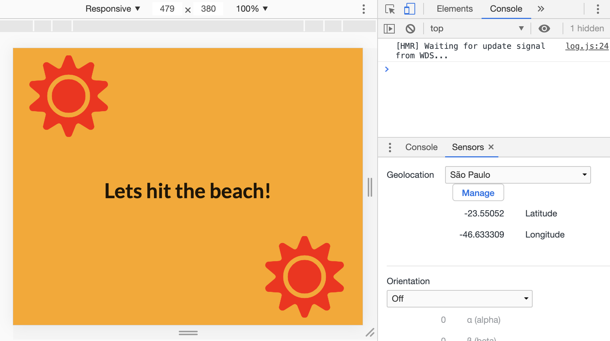
