## create a project named pics
```js
npx create-react-app my-app
cd my-app
npm start
```
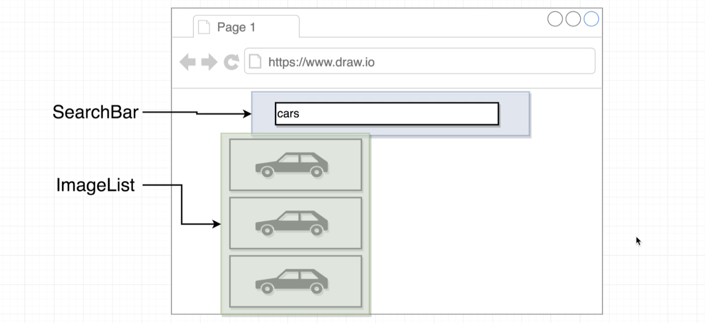
- delete all files in src
- create folder components
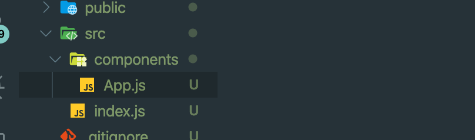
- index.js
```js
import React from 'react';
import ReactDOM from 'react-dom';
import App from './components/App';

ReactDOM.render(
    <App />,
    document.querySelector('#root')
);
```
-
- App.js
```js
import React from 'react';

const App = () => {
    return <div>App</div>;
};

export default App;
```
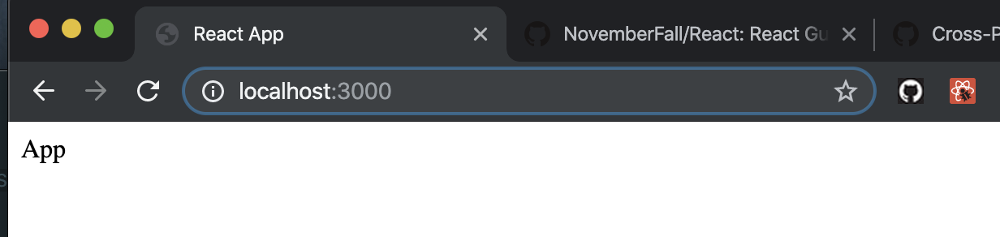
---

## Showing Forms to the User
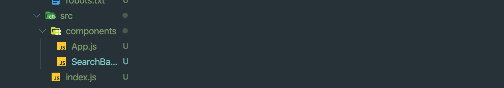
- update SearchBar.js, App.js
```js
import React from 'react';

class SearchBar extends React.Component {
    render() {
        return (
            <div>
                Search Bar
            </div>
        );
    }
}
export default SearchBar;


///////////


import React from 'react';
import SearchBar from './SearchBar';

const App = () => {
    return (
        <div>
            <SearchBar />
        </div>
    );
};

export default App;
```
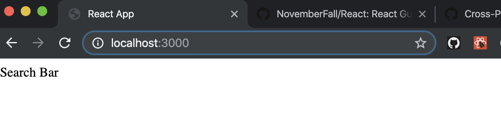
---

#### update SearchBar.js
```js
import React from 'react';

class SearchBar extends React.Component {
    render() {
        return (
            <div>
                <form>
                    <input type="text" />
                </form>
            </div>
        );
    }
}
export default SearchBar;

// we add a input text into our component
```
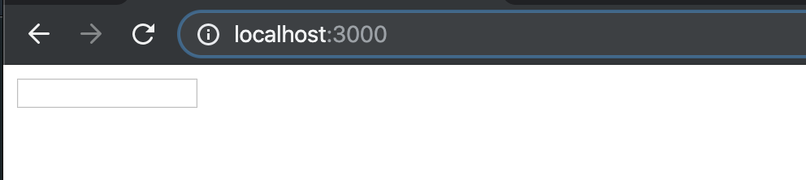
---

## Adding a Touch of style
- import semantic-ui
- `https://cdnjs.cloudflare.com/ajax/libs/semantic-ui/2.4.1/semantic.min.css`
- add into index.html
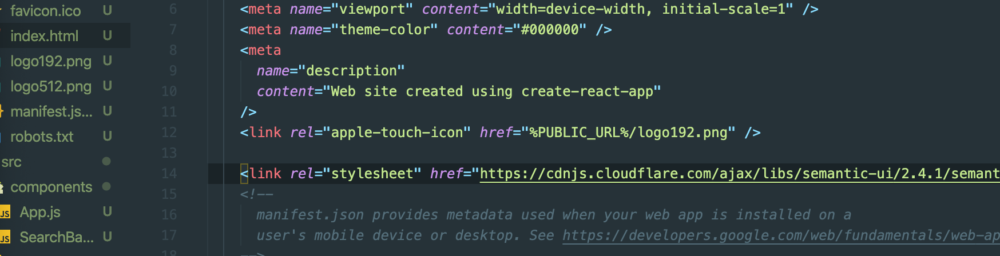

- update App.js
```js
const App = () => {
    return (
        <div className="ui container" style={{ marginTop: '10px' }}>
            <SearchBar />
        </div>
    );
};

export default App;
```
-
- SearchBar.js
```js
class SearchBar extends React.Component {
    render() {
        return (
            <div className="ui segment">
                <form className="ui form">
                    <div className="field">
                        <label>Image Search</label>
                        <input type="text" />
                    </div>
                </form>
            </div>
        );
    }
}
export default SearchBar;
```
---

## Creating Event Handler
- update SearchBar.js
```js
import React from 'react';

class SearchBar extends React.Component {
    onInputChange(event) {
        console.log(event.target.value);
    }
    render() {
        return (
            <div className="ui segment">
                <form className="ui form">
                    <div className="field">
                        <label>Image Search</label>
                        <input type="text" onChange={this.onInputChange} />
                    </div>
                </form>
            </div>
        );
    }
}
export default SearchBar;
```
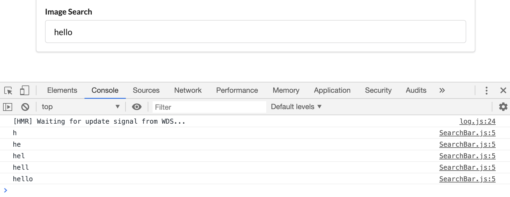
---
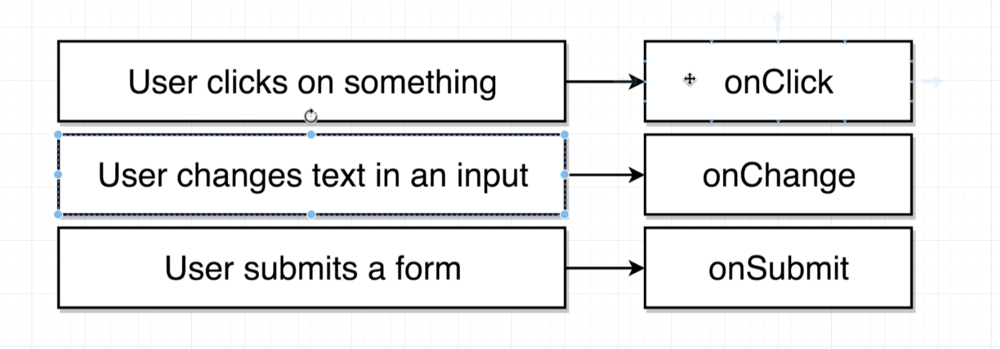
---
- update SearchBar.js
```js
class SearchBar extends React.Component {
    onInputChange(event) {
        console.log(event.target.value);
    }

    onInputClick() {
        console.log('Input was clicked');
    }
    render() {
        return (
            <div className="ui segment">
                <form className="ui form">
                    <div className="field">
                        <label>Image Search</label>
                        <input type="text"
                            onClick={this.onInputClick}
                            onChange={this.onInputChange}
                        />
                    </div>
                </form>
            </div>
        );
    }
}
export default SearchBar;
```
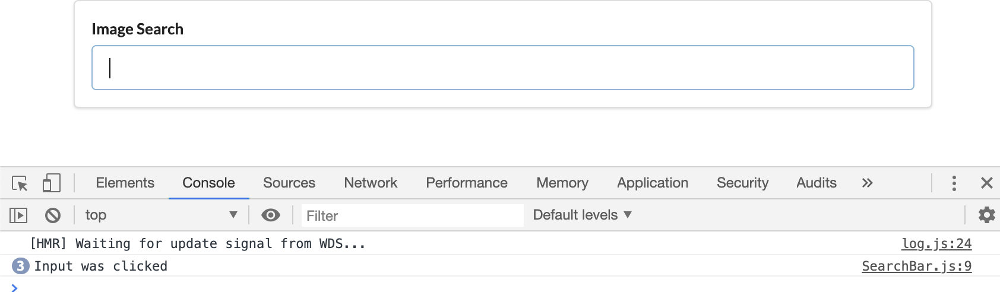
---


## Alternate Event Handle Syntax
- update searchbar.js
```js
class SearchBar extends React.Component {
    onInputChange(event) {
        console.log(event.target.value);
    }

    render() {
        return (
            <div className="ui segment">
                <form className="ui form">
                    <div className="field">
                        <label>Image Search</label>
                        <input type="text"
                            onChange={(e) => { console.log(e.target.value) }}
                        />
                    </div>
                </form>
            </div>
        );
    }
}
export default SearchBar;
```
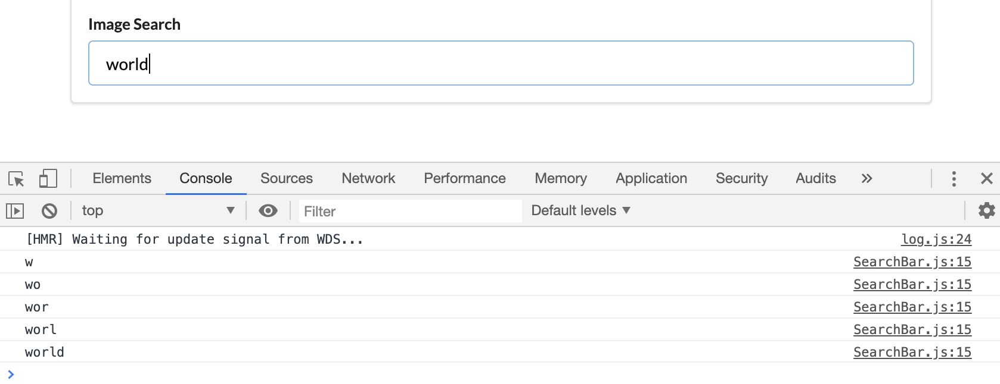
---


## Uncontrolled VS Controlled Elements
- update SearchBar.js
```js
import React from 'react';

class SearchBar extends React.Component {
    state = { term: '' };

    render() {
        return (
            <div className="ui segment">
                <form className="ui form">
                    <div className="field">
                        <label>Image Search</label>
                        <input type="text"
                            value={this.state.term}
                            onChange={(e) => this.setState({ term: e.target.value })}
                        />
                    </div>
                </form>
            </div>
        );
    }
}
export default SearchBar;
```
- so what is the point of all this stuff that we just added?
- Why are we using state?
- Why are we updating state whenever we change the input?
- Why are we passing something called value back into the input?

## More on Controlled Element
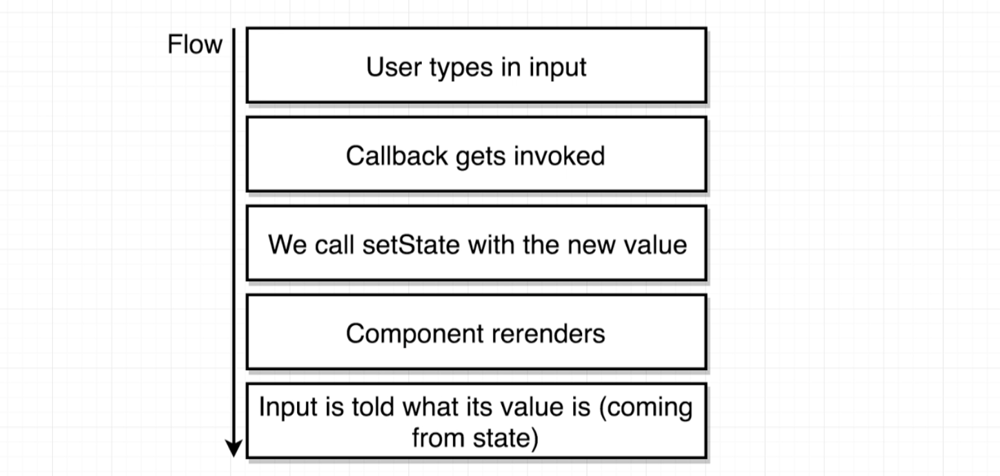
- for react world, we prefect `value={this.state.term}`
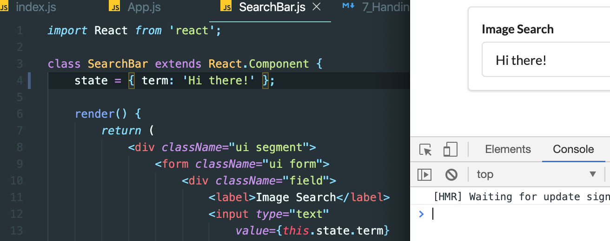
---

## Handing Form Sumbitted
- update SearchBar.js
```js
import React from 'react';

class SearchBar extends React.Component {
    state = { term: 'Hi there!' };

    onFormSubmit(event) {
        event.preventDefault();
        console.log(this.state.term);
    }
    render() {
        return (
            <div className="ui segment">
                <form onSubmit={this.onFormSubmit} className="ui form">
                    <div className="field">
                        <label>Image Search</label>
                        <input type="text"
                            value={this.state.term}
                            onChange={(e) => this.setState({ term: e.target.value })}
                        />
                    </div>
                </form>
            </div>
        );
    }
}
export default SearchBar;
```
- when we submitted
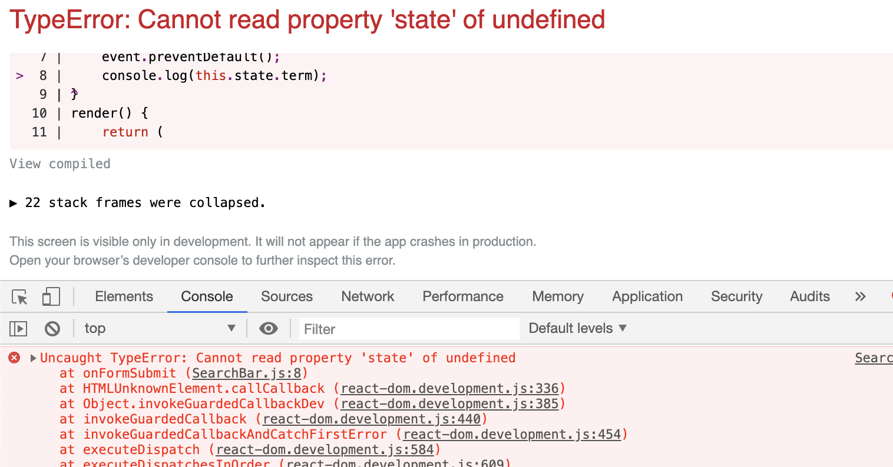
- but here has error
- there will be q quick and easy fix but understanding the fix can be just a little bit challenging sometimes.
---


## Understanding 'this' in JavaScript
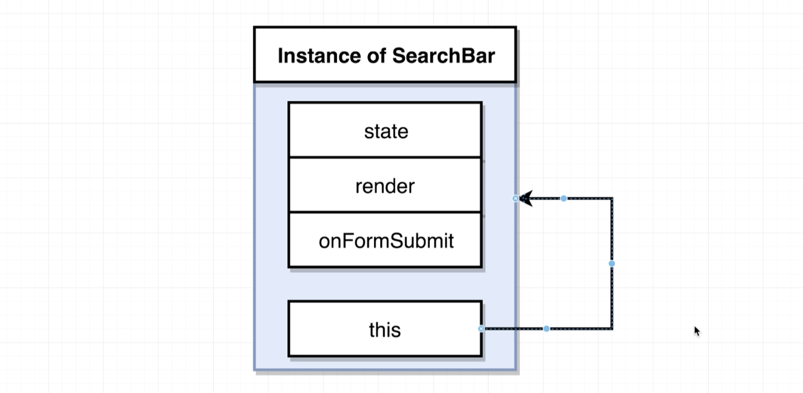
- look at this example:
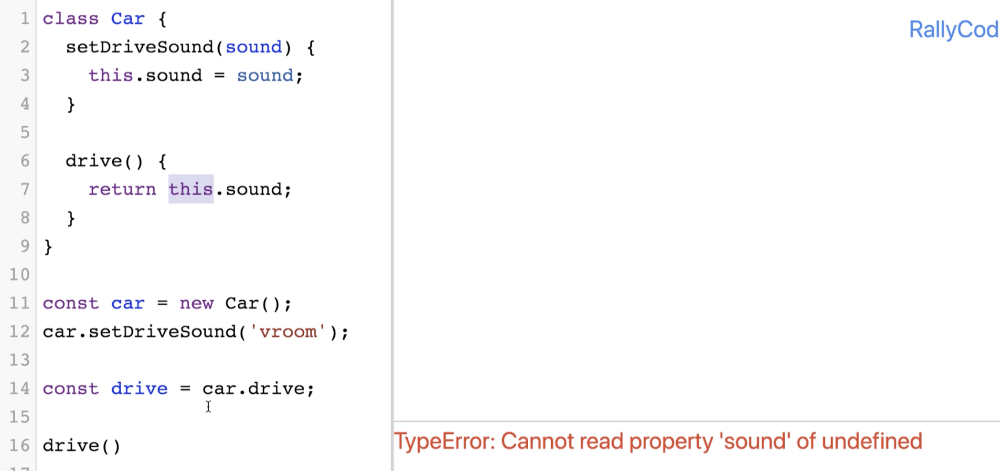
---


## Solving Context Issue
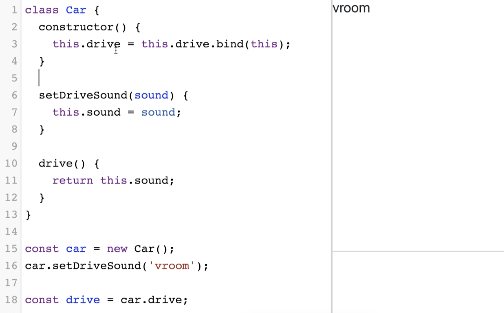

- so we can use ES6 arrow function to do so
- update SearchBark.js
```js
//2nd way to solve `this`, by using arrow function
import React from 'react';

class SearchBar extends React.Component {
    state = { term: 'Hi there!' };

    onFormSubmit = (event) => {
        event.preventDefault();
        console.log(this.state.term);
    }
    render() {
        return (
            <div className="ui segment">
                <form onSubmit={this.onFormSubmit} className="ui form">
                    <div className="field">
                        <label>Image Search</label>
                        <input type="text"
                            value={this.state.term}
                            onChange={(e) => this.setState({ term: e.target.value })}
                        />
                    </div>
                </form>
            </div>
        );
    }
}
export default SearchBar;
```
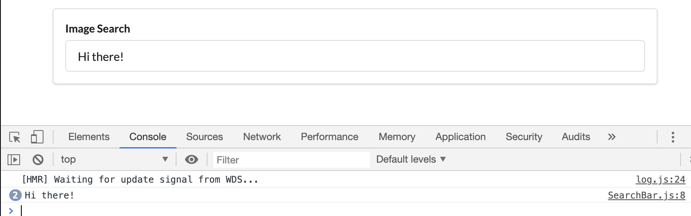
- now we see the error has gone!
---

### the 2nd way to solve `this`
- update searchbar.js
```js
//one way for solve `this`
import React from 'react';

class SearchBar extends React.Component {
    state = { term: 'Hi there!' };

    onFormSubmit(event) {
        event.preventDefault();
        console.log(this.state.term);
    }
    render() {
        return (
            <div className="ui segment">
                <form onSubmit={(event) => this.onFormSubmit(event)} className="ui form">
                    <div className="field">
                        <label>Image Search</label>
                        <input type="text"
                            value={this.state.term}
                            onChange={(e) => this.setState({ term: e.target.value })}
                        />
                    </div>
                </form>
            </div>
        );
    }
}
export default SearchBar;
```
- still work
---


## Communicating Child to Parent
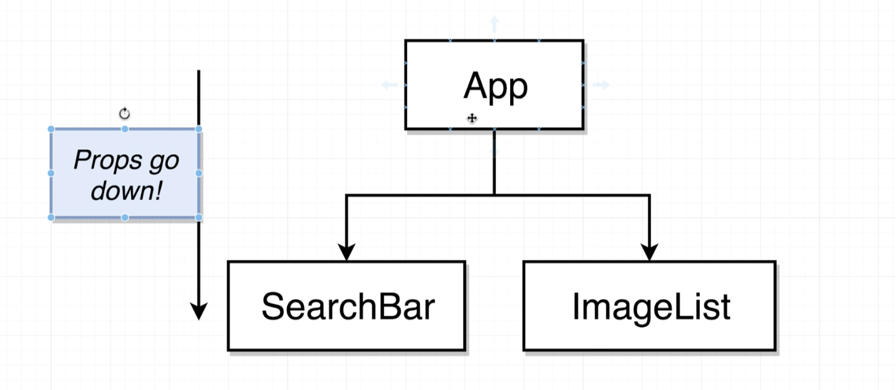
- we can only pass info from the app component down to SearchBar through `props`.


## Invoking Callbacks in Children
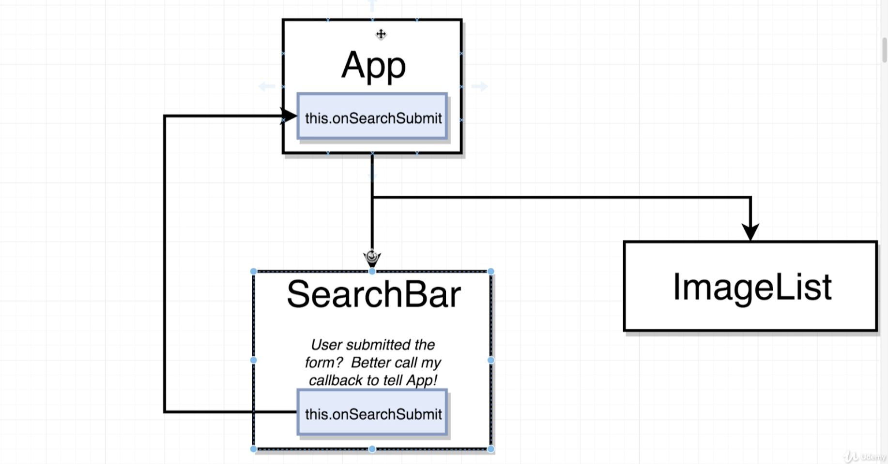
- update SearchBar.js
```js
//2nd way to solve `this`, by using arrow function
import React from 'react';

class SearchBar extends React.Component {
    state = { term: 'Hi there!' };

    onFormSubmit = (event) => {
        event.preventDefault();
        this.props.onSubmit(this.state.term);
    }
    render() {
        return (
            <div className="ui segment">
                <form onSubmit={this.onFormSubmit} className="ui form">
                    <div className="field">
                        <label>Image Search</label>
                        <input type="text"
                            value={this.state.term}
                            onChange={(e) => this.setState({ term: e.target.value })}
                        />
                    </div>
                </form>
            </div>
        );
    }
}
export default SearchBar;
```
-
- update App.js
```js
class App extends React.Component {
    onSearchSubmit(term) {
        console.log(term);
    }

    render() {
        return (
            <div className="ui container" style={{ marginTop: '10px' }}>
                <SearchBar
                    onSubmit={this.onSearchSubmit}
                />
            </div >
        );
    }
};

export default App;
```
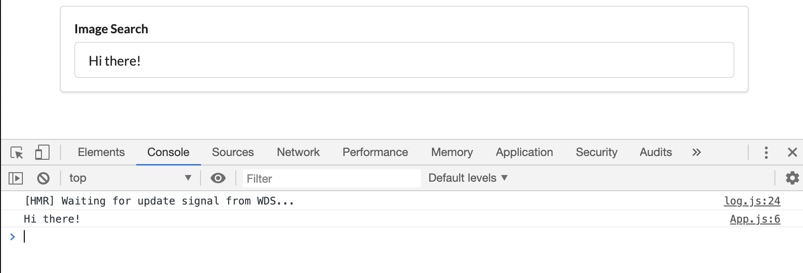
- still work!