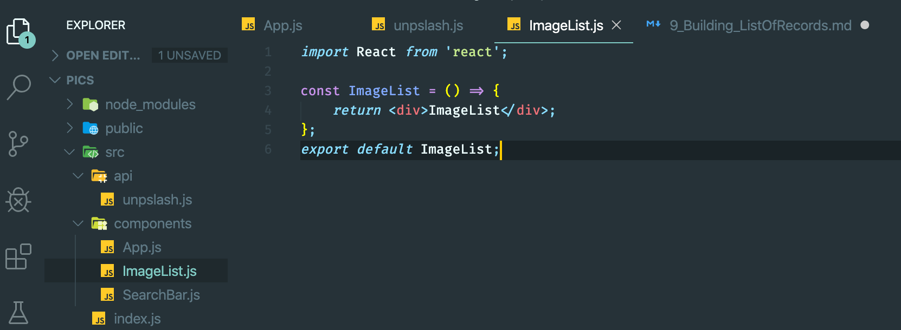
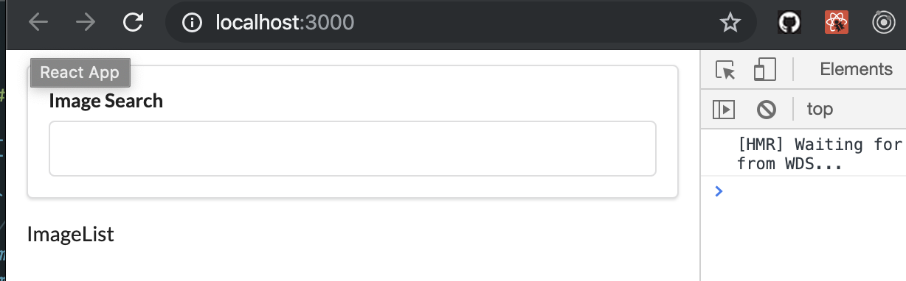
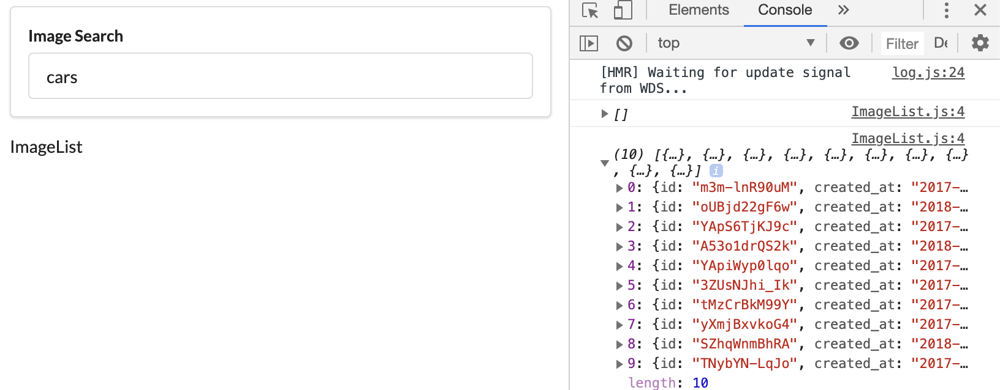
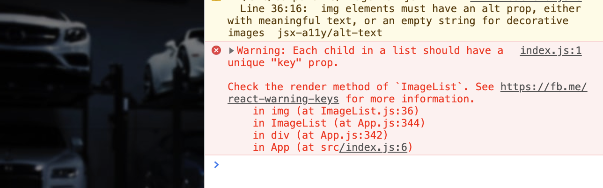
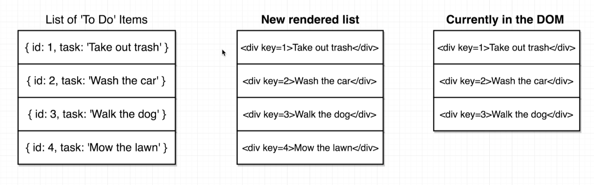
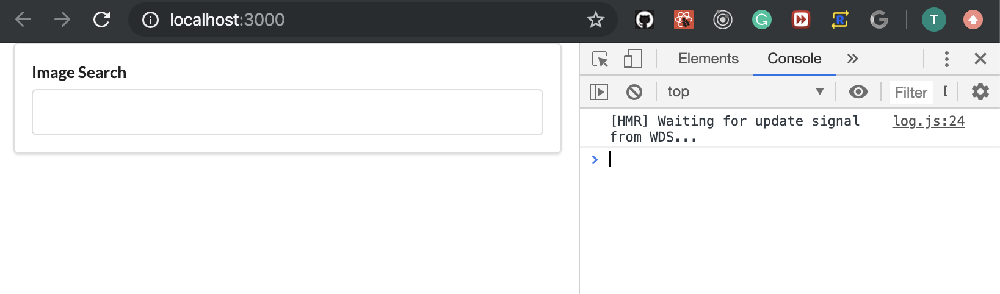

## Rendering Lists
- create ImageList.js

- update App.js
```js
//Rendering Lists
import React from 'react';
import unsplash from '../api/unpslash';
import SearchBar from './SearchBar';
import ImageList from './ImageList';
class App extends React.Component {
    state = { images: [] }

    onSearchSubmit = async (term) => {
        const response = await unsplash.get('search/photos', {
            params: { query: term }
        });

        this.setState({ images: response.data.results });
    }

    render() {
        return (
            <div className="ui container" style={{ marginTop: '10px' }}>
                <SearchBar onSubmit={this.onSearchSubmit} />
                <ImageList />
            </div >
        );
    }
};
export default App;
```

---
- update App.js
```js
//Rendering Lists
import React from 'react';
import unsplash from '../api/unpslash';
import SearchBar from './SearchBar';
import ImageList from './ImageList';
class App extends React.Component {
    state = { images: [] }

    onSearchSubmit = async (term) => {
        const response = await unsplash.get('search/photos', {
            params: { query: term }
        });

        this.setState({ images: response.data.results });
    }

    render() {
        return (
            <div className="ui container" style={{ marginTop: '10px' }}>
                <SearchBar onSubmit={this.onSearchSubmit} />
                <ImageList images={this.state.images} />
            </div >
        );
    }
};
export default App;
```
-
- pass props into `ImageList`
- update ImageList.js
```js
import React from 'react';

const ImageList = (props) => {
    console.log(props.images)
    return <div>ImageList</div>;
};
export default ImageList;
```

---

## Review of Map Statements
- to see javascript github repo
---


## Rendering Lists of Components
- update ImageList.js, by using map statement
```js
//Rendering Lists of Components
import React from 'react';

const ImageList = (props) => {
    const images = props.images.map((image) => {
        return 
    });

    return <div>{images}}</div>;
};
export default ImageList;
```

---

## The purpose of keys in Lists

- in previous, we see this warnning:

    1. the react list needs unique key
    2. needs alt attribute

---


## Implementing keys in Lists
- update ImageList.js
```js
//Implementing keys in Lists
import React from 'react';

const ImageList = (props) => {
    const images = props.images.map(({ description, id, urls }) => {
        return 
    });

    return <div>{images}</div>;
};
export default ImageList;
```

- now there is no warnning
---