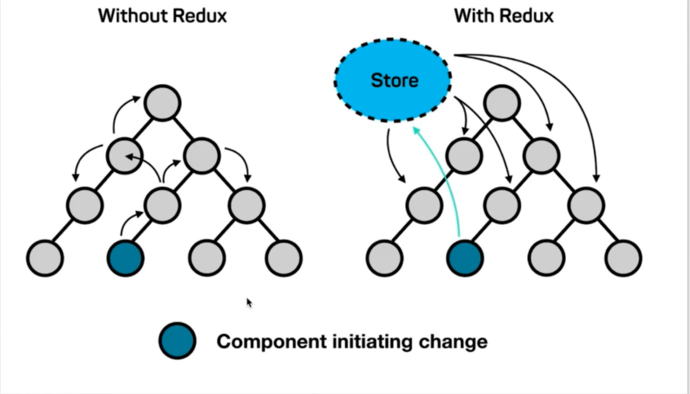
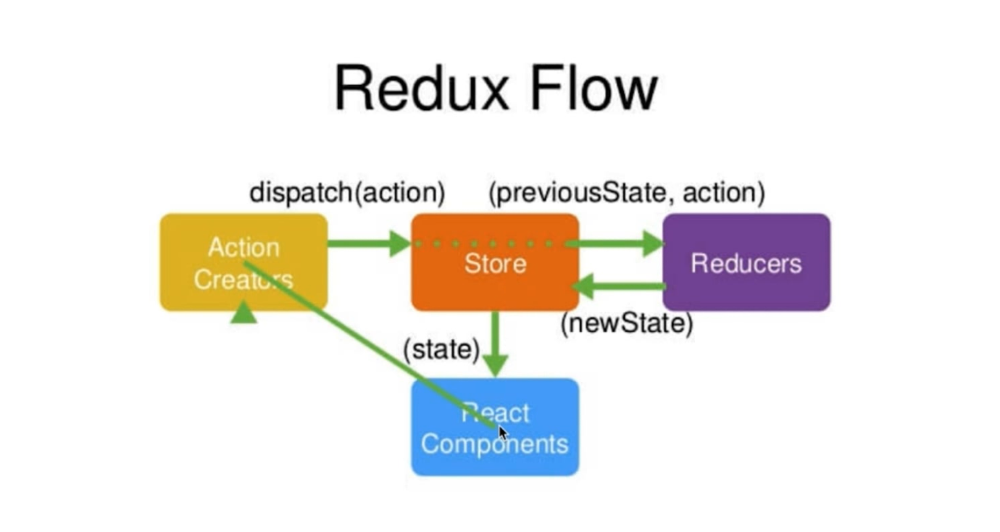
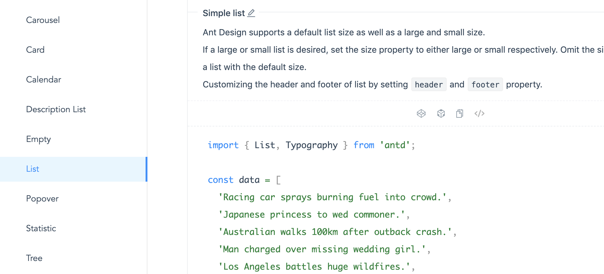
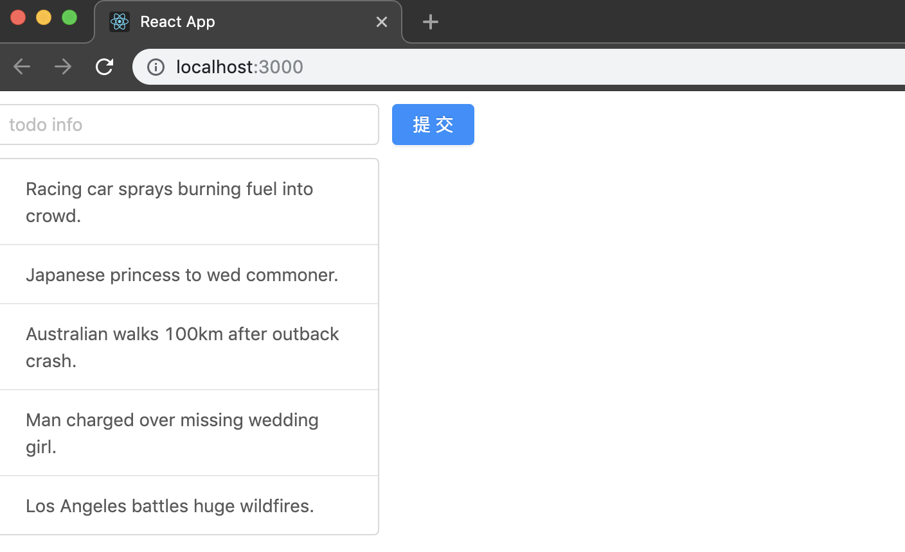
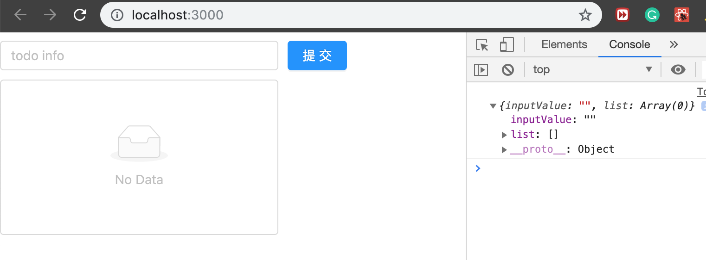
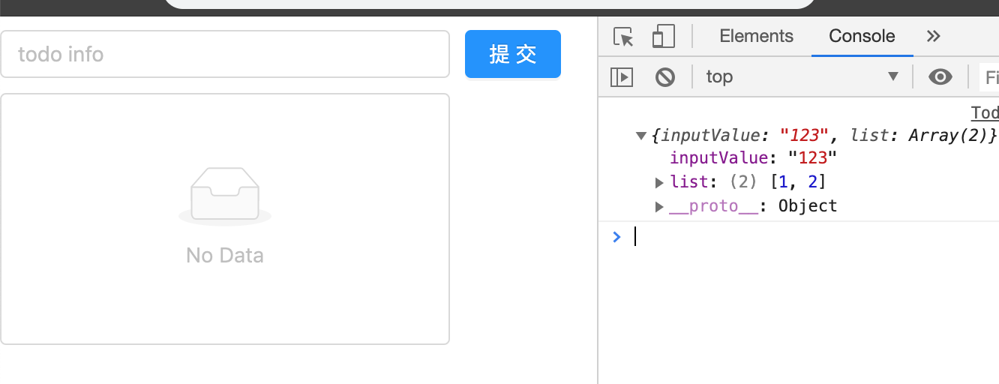
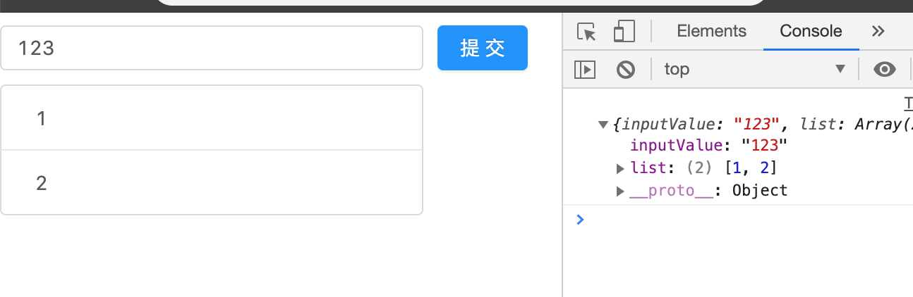
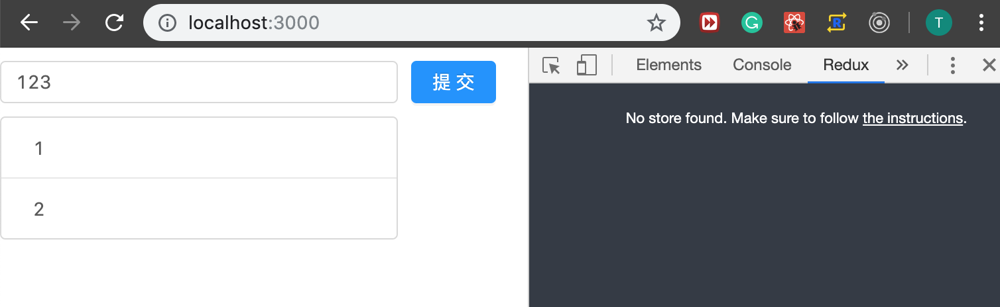
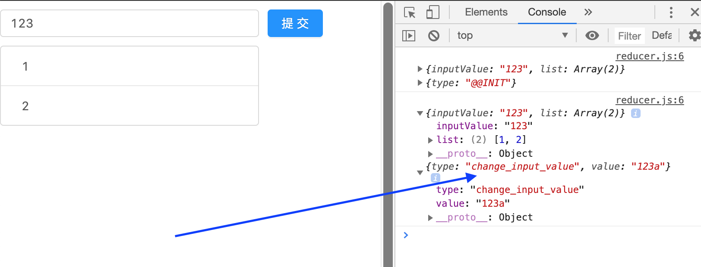
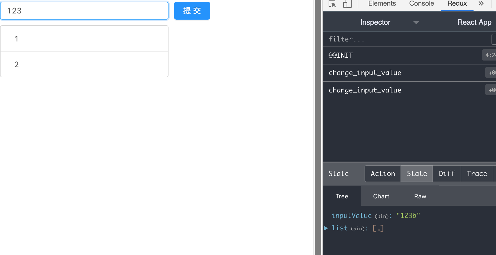

### `Redux 概念`

- 假如没有redux 组件之间的传值非常复杂


- Rudux 把数据存储到共用的存储区域，其他组件就可以共享数据

### `Redux = Reducer + Flux`

- 工作流程：



### `Ant Design UI 实现TodoList网页布局`


- Installation
  [Ant Design Installation](https://ant.design/docs/react/introduce)
`npm install antd`

### `第一步，我们需要import css`
`import 'antd/dist/antd.css';`

- 现在我们来import 一个input 组件


- button 组件方法和上面一样，(之后更新代码)
- 首先引入button
`import { Input, Button } from 'antd';;`


- 接着我们来引进一个简单列表


`index.js`
```js
import React from 'react';
import ReactDOM from 'react-dom';
import TodoList from './TodoList';
ReactDOM.render(<TodoList />, document.getElementById('root'));
```
`TodoList.js`
```js
import React, { Component } from 'react';
import 'antd/dist/antd.css';
import { Input, Button, List } from 'antd';

const data = [
    'Racing car sprays burning fuel into crowd.',
    'Japanese princess to wed commoner.',
    'Australian walks 100km after outback crash.',
    'Man charged over missing wedding girl.',
    'Los Angeles battles huge wildfires.',
];

class TodoList extends Component {
    render() {
        return (
            <div style={{ marginTop: '10px', marginLetf: '10px' }}>
                <div>
                    <Input placeholder='todo info' style={{ width: 300, marginRight: 10 }} />
                    <Button type="primary">提交</Button>
                </div>
                <List
                    style={{ marginTop: 10, width: 300 }}
                    bordered
                    dataSource={data}
                    renderItem={item => (<List.Item>{item}</List.Item>)}
                />
            </div>
        )
    }
}
export default TodoList;
```


### `Ant Design 是一个可以设计很漂亮的后台页面,是一个后台开发用的很多的库`


### `现在开始进入redux编码`

### `Store的创建`

- redux 的安装
`npm install redux`

- 安装成功以后，我们该如何使用redux
  1. creating a folder named `store` under `src` folder
  2. in `store` folder, we created a `index.js`
- remember: the index.js in the `store` forder, 就是创建store代码存放的位置
`store -> index.js`
```js
import { createStore } from 'redux';
const store = createStore();
export default store;
``` 
- 现在我们已经创建了一个 store, 但是它还什么都不能做
- 我们必须创建一个类似于笔记本的功能的js文件 `reducer.js` in the `store` folder
- in the `reducer.js` we just need to return a function;   
```js
//reducer.js
const defaultState = {}
export default (state = defaultState, action) => {
    return state;
}

/* 这段代码解释：首先reducer创建了一个default state， 然后读写数据后返回一个新的state */
```
- 现在我们对 `src` folder下的 `index.js reducer.js`的代码进行更新
```js
//reducer.js
const defaultState = {
    inputValue: '',
    list: []
}
export default (state = defaultState, action) => {
    return state;
}
/* 
1. here, we make inputValue equal nothing for default 
2. creating a new list []
*/

//index.js
import { createStore } from 'redux';
import reducer from './reducer';
const store = createStore(reducer);
export default store;
/*
1. we import  reducer
2. store will receive data from reducer
 */
```
### `现在我们要在todolist使用store的data`
```js
import React, { Component } from 'react';
import 'antd/dist/antd.css';
import { Input, Button, List } from 'antd';
import store from './store';
class TodoList extends Component {
    constructor(props) {
        super(props);
        console.log(store.getState());
    }
    render() {
        return (
            <div style={{ marginTop: '10px', marginLetf: '10px' }}>
                <div>
                    <Input placeholder='todo info' style={{ width: 300, marginRight: 10 }} />
                    <Button type="primary">提交</Button>
                </div>
                <List
                    style={{ marginTop: 10, width: 300 }}
                    bordered
                    dataSource={[]}
                    renderItem={item => (<List.Item>{item}</List.Item>)}
                />
            </div>
        )
    }
}
export default TodoList;
```
- now we can see the inputValue is null, list[] = null


- we can do one more testing
- updating reducer.js
```js
const defaultState = {
    inputValue: '123',
    list: [1, 2]
}
export default (state = defaultState, action) => {
    return state;
}
```


- 这就意味着我们已经可以获得store's 数据
- 现在todolist's state就可以获取store's 数据

```js
//todolist
import React, { Component } from 'react';
import 'antd/dist/antd.css';
import { Input, Button, List } from 'antd';
import store from './store';

class TodoList extends Component {
    constructor(props) {
        super(props);
        this.state = store.getState();
        console.log(this.state);
    }
    render() {
        return (
            <div style={{ marginTop: '10px', marginLetf: '10px' }}>
                <div>
                    <Input value={this.state.inputValue} placeholder='todo info' style={{ width: 300, marginRight: 10 }} />
                    <Button type="primary">提交</Button>
                </div>
                <List
                    style={{ marginTop: 10, width: 300 }}
                    bordered
                    dataSource={this.state.list}
                    renderItem={item => (<List.Item>{item}</List.Item>)}
                />
            </div>
        )
    }
}
export default TodoList;
```
- now TodoList receive the data, then todolist can do its work



### `Action and Reducer`
- 现在添加一个`redux devtools` into chrome browser

- how to use Redux devTools on chrome to test?


- click `the instructions`
[redux devtools instructions](https://github.com/zalmoxisus/redux-devtools-extension#usage)
- we can add `window.__REDUX_DEVTOOLS_EXTENSION__ && window.__REDUX_DEVTOOLS_EXTENSION__()` into `createStore()` in index.js


- now React Component hopes to communicate with Store:
```js
//todolist
import 'antd/dist/antd.css';
import { Input, Button, List } from 'antd';
import store from './store';
class TodoList extends Component {
    constructor(props) {
        super(props);
        this.state = store.getState();
        // this.handleInputChange = this.handleInputChange.bind(this);
    }
    handleInputChange = (e) => {
        const action = {
            type: 'change_input_value',
            value: e.target.value
        }
        store.dispatch(action);
    }
    render() {
        return (
            <div style={{ marginTop: '10px', marginLetf: '10px' }}>
                <div>
                    <Input
                        value={this.state.inputValue}
                        placeholder='todo info'
                        style={{ width: 300, marginRight: 10 }}
                        onChange={this.handleInputChange}
                    />
                    <Button type="primary">提交</Button>
                </div>
                <List
                    style={{ marginTop: 10, width: 300 }}
                    bordered
                    dataSource={this.state.list}
                    renderItem={item => (<List.Item>{item}</List.Item>)}
                />
            </div>
        )
    }
}
```
- we have added `handleInputChange` function to dispatch action
- then Store will send `state, action` to Reducers
- we can prove this:
```js
//reducer.js
const defaultState = {
    inputValue: '123',
    list: [1, 2]
}
export default (state = defaultState, action) => {
    console.log(state, action);
    return state;
}
```

- this can prove that reducer has received the state and action

- Reducer 拿到了之前的数据，处理完接受的数据，返回新的数据给Store
- 假如reducer希望改变 以前store's data
  1. 定义一个新变量（newState）来接收之前state's deep copy
  2. return newState
  3. reducer 可以接受state，但是绝不能修改state,  所以要进行deep copy
  4. 以下的写法为固定写法
```js
//reducer.js
const defaultState = {
    inputValue: '123',
    list: [1, 2]
}
//reducer 可以接受state，但是绝不能修改state
export default (state = defaultState, action) => {
    if (action.type === 'change_input_value') {
        const newState = JSON.parse(JSON.stringify(state));
        newState.inputValue = action.value;
        return newState;
    }
    console.log(state, action);
    return state;
}
```
### `这里需要注意的是，Reducer 返回的newState实际上返回给Store`

- 到这里Store已经接收到newState, 可以看到inputValue = "123b"; 但是问题是页面并没有更新
- 这是因为我们还有 `Store -> React Component` 这一步工作还要继续。

- in TodoList, we call setState() to alter this.state
- 我们给button 绑定onClick事件
- onClick 函数， 则要发送action to Store
- 注意：Store并不知道要怎么处理数据，还是交给Reducer (注意流程图)
```js
//updating TodoList

class TodoList extends Component {
    constructor(props) {
        super(props);
        this.state = store.getState();
        // this.handleInputChange = this.handleInputChange.bind(this);
        // this.handleStoreChange = this.handleStoreChange.bind(this);
        // this.handleBtnClick = this.handleBtnClick.bind(this);
        store.subscribe(this.handleStoreChange);//监听数据的变化
    }
    handleStoreChange = () => {
        this.setState(store.getState());
    }
    handleInputChange = (e) => {
        const action = {
            type: 'change_input_value',
            value: e.target.value
        }
        store.dispatch(action);
    }
    handleBtnClick = () => {
        const action = {
            type: 'add_todo_item',
        };
        store.dispatch(action);
    }
    render() {
        return (
            <div style={{ marginTop: '10px', marginLetf: '10px' }}>
                <div>
                    <Input
                        value={this.state.inputValue}
                        placeholder='todo info'
                        style={{ width: 300, marginRight: 10 }}
                        onChange={this.handleInputChange}
                    />
                    <Button type="primary" onClick={this.handleBtnClick}>提交</Button>
                </div>
                <List
                    style={{ marginTop: 10, width: 300 }}
                    bordered
                    dataSource={this.state.list}
                    renderItem={item => (<List.Item>{item}</List.Item>)}
                />
            </div>
        )
    }
}
export default TodoList;
```
### `现在store 依然把数据交给reducer处理`
`updating reducer.js`
```js
const defaultState = {
    inputValue: '123',
    list: [1, 2]
}
//reducer 可以接受state，但是绝不能修改state
export default (state = defaultState, action) => {
    if (action.type === 'change_input_value') {
        const newState = JSON.parse(JSON.stringify(state));
        newState.inputValue = action.value;
        return newState;
    }
    if (action.type === 'add_todo_item') {
        const newState = JSON.parse(JSON.stringify(state));
        newState.list.push(newState.inputValue);
        newState.inputValue = '';
        // console.log(newState);
        return newState;
    }
    return state;
}
```


### `TodoList的删除功能`

- 我们已经import了 antd library，并且用了它的组件 List
```js
                <List
                    style={{ marginTop: 10, width: 300 }}
                    bordered
                    dataSource={this.state.list}
                    renderItem={item => (<List.Item>{item}</List.Item>)}
                />
```
- 通过这段代码，我们可以看到 每一个条目是由 <List.Item> 渲染的，所以如果我们要将其删除
- 就给 <List.Item> 绑定一个删除事件
- 同时实现 handleItemDelete 这个函数
- 像之前做过的一样，我们让store 发送这个action to reducer
- 在reducer里， 生成一个副本newState接收发data from store, 然后调用数组list[].splice() 函数来删除所要删除的item

`updating TodoList reducer`
```js
class TodoList extends Component {
    constructor(props) {
        super(props);
        this.state = store.getState();
        // this.handleInputChange = this.handleInputChange.bind(this);
        // this.handleStoreChange = this.handleStoreChange.bind(this);
        // this.handleBtnClick = this.handleBtnClick.bind(this);
        store.subscribe(this.handleStoreChange);
    }
    handleStoreChange = () => {
        this.setState(store.getState());
    }
    handleInputChange = (e) => {
        const action = {
            type: 'change_input_value',
            value: e.target.value
        }
        store.dispatch(action);
    }
    handleBtnClick = () => {
        const action = {
            type: 'add_todo_item',
        };
        store.dispatch(action);
    }
    handleItemDelete = (index) => {
        const action = {
            type: 'delete_todo_item',
            index
        }
        store.dispatch(action);
    }
    render() {
        return (
            <div style={{ marginTop: '10px', marginLetf: '10px' }}>
                <div>
                    <Input
                        value={this.state.inputValue}
                        placeholder='todo info'
                        style={{ width: 300, marginRight: 10 }}
                        onChange={this.handleInputChange}
                    />
                    <Button type="primary" onClick={this.handleBtnClick}>提交</Button>
                </div>
                <List
                    style={{ marginTop: 10, width: 300 }}
                    bordered
                    dataSource={this.state.list}
                    renderItem={(item, index) => (
                        <List.Item onClick={this.handleItemDelete.bind(this, index)}>{item}</List.Item>
                    )}
                />
            </div>
        )
    }
}


const defaultState = {
    inputValue: '',
    list: []
}

//reducer 可以接受state，但是绝不能修改state
export default (state = defaultState, action) => {
    if (action.type === 'change_input_value') {
        const newState = JSON.parse(JSON.stringify(state));
        newState.inputValue = action.value;
        return newState;
    }
    if (action.type === 'add_todo_item') {
        const newState = JSON.parse(JSON.stringify(state));
        newState.list.push(newState.inputValue);
        newState.inputValue = '';
        // console.log(newState);
        return newState;
    }
    if (action.type === 'delete_todo_item') {
        const newState = JSON.parse(JSON.stringify(state));
        newState.list.splice(action.index, 1);
        return newState;
    }
    return state;
}
```


### `ActionTypes 的拆分`
- 目前在我们的todolist, 有很多action, 但是每一个action有自己的类型type
- 同时recuder会接收我们的action，然后根据不同的type 根据不同的类型采用不同方式改变数据
- 比如`change_input_value`， 假如我们拼写成 `change_inptu_value` 然后工作台不会报错，网页则有异常，很可能找几个小时才找到这个小错误，为了解决这个问题：
  1. 我们在`store` folder, creating a `actionTypes.js` 
```js
//we create 3 const variable
export const CHANGE_INPUT_VALUE = 'change_input_value'; 
export const ADD_TODO_ITEM = 'add_todo_item'; 
export const DELETE_TODO_ITEM = 'delete_todo_item'; 
```
  2. updated `TodoList.js reducer.js`
```js
import React, { Component } from 'react';
import 'antd/dist/antd.css';
import { Input, Button, List } from 'antd';
import store from './store';
import { CHANGE_INPUT_VALUE, ADD_TODO_ITEM, DELETE_TODO_ITEM } from './store/actionTypes'

class TodoList extends Component {
    constructor(props) {
        super(props);
        this.state = store.getState();
        // this.handleInputChange = this.handleInputChange.bind(this);
        // this.handleStoreChange = this.handleStoreChange.bind(this);
        // this.handleBtnClick = this.handleBtnClick.bind(this);
        store.subscribe(this.handleStoreChange);
    }
    handleStoreChange = () => {
        this.setState(store.getState());
    }
    handleInputChange = (e) => {
        const action = {
            type: CHANGE_INPUT_VALUE,
            value: e.target.value
        }
        store.dispatch(action);
    }
    handleBtnClick = () => {
        const action = {
            type: ADD_TODO_ITEM,
        };
        store.dispatch(action);
    }
    handleItemDelete = (index) => {
        const action = {
            type: DELETE_TODO_ITEM,
            index
        }
        store.dispatch(action);
    }
    render() {
        return (
            <div style={{ marginTop: '10px', marginLetf: '10px' }}>
                <div>
                    <Input
                        value={this.state.inputValue}
                        placeholder='todo info'
                        style={{ width: 300, marginRight: 10 }}
                        onChange={this.handleInputChange}
                    />
                    <Button type="primary" onClick={this.handleBtnClick}>提交</Button>
                </div>
                <List
                    style={{ marginTop: 10, width: 300 }}
                    bordered
                    dataSource={this.state.list}
                    renderItem={(item, index) => (
                        <List.Item onClick={this.handleItemDelete.bind(this, index)}>{item}</List.Item>
                    )}
                />
            </div>
        )
    }
}
export default TodoList;


//reducer
import { CHANGE_INPUT_VALUE, ADD_TODO_ITEM, DELETE_TODO_ITEM } from './actionTypes'
const defaultState = {
    inputValue: '',
    list: []
}

//reducer 可以接受state，但是绝不能修改state
export default (state = defaultState, action) => {
    if (action.type === CHANGE_INPUT_VALUE) {
        const newState = JSON.parse(JSON.stringify(state));
        newState.inputValue = action.value;
        return newState;
    }
    if (action.type === ADD_TODO_ITEM) {
        const newState = JSON.parse(JSON.stringify(state));
        newState.list.push(newState.inputValue);
        newState.inputValue = '';
        // console.log(newState);
        return newState;
    }
    if (action.type === DELETE_TODO_ITEM) {
        const newState = JSON.parse(JSON.stringify(state));
        newState.list.splice(action.index, 1);
        return newState;
    }
    return state;
}
```
- 但你一定会有疑问，这么做不是又多创建了一个文件，并且又多写了些代码，那接下来看如果发生拼写错误


- 之前我们在网页上和工作台都无法发现这个错误

### `使用 actionCreater 统一创建action`
- 在我们的todolist里有许多 action，如果我们的业务逻辑少的时候，我们尚可解决，但是当我们的业务逻辑非常复杂的时候，最好的办法是统一创建action

`actionCreators.js`
```js
import { CHANGE_INPUT_VALUE, ADD_TODO_ITEM, DELETE_TODO_ITEM } from "./actionTypes";

export const getInputChangeAction = (value) => ({
    type: CHANGE_INPUT_VALUE,
    value
});

export const getAddItemAction = () => ({
    type: ADD_TODO_ITEM
});

export const getDeleteItemAction = (index) => ({
    type: DELETE_TODO_ITEM,
    index
});
```
`updating TodoList.js`
```js
//代码优化
import React, { Component } from 'react';
import 'antd/dist/antd.css';
import { Input, Button, List } from 'antd';
import store from './store';
import { getInputChangeAction, getAddItemAction, getDeleteItemAction } from './store/actionCreators';
class TodoList extends Component {
    constructor(props) {
        super(props);
        this.state = store.getState();
        // this.handleInputChange = this.handleInputChange.bind(this);
        // this.handleStoreChange = this.handleStoreChange.bind(this);
        // this.handleBtnClick = this.handleBtnClick.bind(this);
        store.subscribe(this.handleStoreChange);
    }
    handleStoreChange = () => {
        this.setState(store.getState());
    }
    handleInputChange = (e) => {
        const action = getInputChangeAction(e.target.value);
        store.dispatch(action);
    }
    handleBtnClick = () => {
        const action = getAddItemAction();
        store.dispatch(action);
    }
    handleItemDelete = (index) => {
        const action = getDeleteItemAction(index);
        store.dispatch(action);
    }
    render() {
        return (
            <div style={{ marginTop: '10px', marginLetf: '10px' }}>
                <div>
                    <Input
                        value={this.state.inputValue}
                        placeholder='todo info'
                        style={{ width: 300, marginRight: 10 }}
                        onChange={this.handleInputChange}
                    />
                    <Button type="primary" onClick={this.handleBtnClick}>提交</Button>
                </div>
                <List
                    style={{ marginTop: 10, width: 300 }}
                    bordered
                    dataSource={this.state.list}
                    renderItem={(item, index) => (
                        <List.Item onClick={this.handleItemDelete.bind(this, index)}>{item}</List.Item>
                    )}
                />
            </div>
        )
    }
}
export default TodoList;
```


### `知识总结： `
- store是唯一的， 
- 只有store能改变自己的内容
- 注意： reducer 拿到之前store的数据，然后返回一个新的数据给store，然后由store对数据进行更新
- reducer 必须是纯函数（给固定的输入，就一定会有固定的输出，而且不会有任何的副作用）

### `redux中核心的api`
- createStore
- store.dispatch
- store.getState
- sotre.subscribe 订阅store的改变
